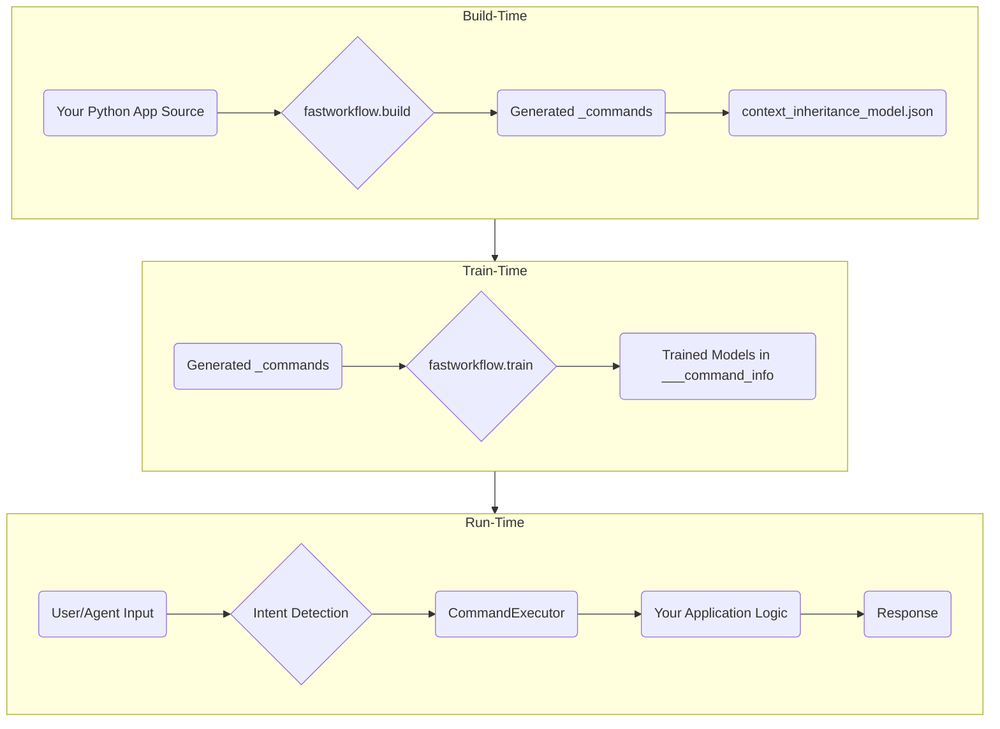

# `fastWorkflow`

[](LICENSE)
[](<LINK_TO_CI>)

A framework for rapidly building large-scale, deterministic, interactive workflows on top of existing Python applications, featuring a fault-tolerant, conversational UX and AI-powered recommendations.

---

### Who is this for?

| `fastWorkflow` is a great fit if... | `fastWorkflow` might be overkill if... |
| :--- | :--- |
| ✅ You have an existing Python domain model and want to add a conversational or agentic interface **without** rewriting business logic. | ❌ You just need a standard CRUD REST or GraphQL API. |
| ✅ You are building back-office tools that benefit from multi-step, interactive command sequences (e.g., inventory management, data review). | ❌ Your system requires ultra-low latency (1k+ TPS) where any NLP overhead is unacceptable. |
| ✅ You prefer a *convention-over-configuration* approach and want to auto-generate boilerplate for your CLI/agent interface. | ❌ Your project requires every API endpoint to be handcrafted with bespoke JSON payloads and manual routing. |

> **See it in Action**: A live terminal chat session of the `hello_world` example is available at [docs/assets/hello_world_demo.gif](docs/assets/hello_world_demo.gif).

---

## Architecture Overview

`fastWorkflow` separates the build-time, train-time, and run-time concerns. The `build` tool creates a command interface from your code, the `train` tool builds NLP models to understand commands, and the `run` scripts execute the workflow.



---

## Installation

To get started, install `fastWorkflow` from PyPI using pip:

```sh
pip install fastworkflow
# Or with uv
uv pip install fastworkflow
```

---

## Quick Start: Running an Example in 5 Minutes

This is the fastest way to see `fastWorkflow` in action.

### Step 1: Fetch and Train the `hello_world` Example

The `fastworkflow` command-line tool can fetch bundled examples and train them for you in one step.

```sh
fastworkflow examples train hello_world
```
This command will:
1. Copy the `hello_world` example into a new `./examples/hello_world/` directory.
2. Create dummy `.env` and `passwords.env` files if they don't exist.
3. Train the intent-detection models for the workflow.

### Step 2: Run the Example

Once training is complete, run the interactive assistant:

```sh
fastworkflow run examples/hello_world .env passwords.env --startup_command startup
```

You will be greeted with a `User >` prompt. Try it out!

```
User > greet from fastWorkflow
> Workflow 12345 AI> Artifact: result=Hello, fastWorkflow!
```
To see other available examples, run `fastworkflow examples list`.

---

## Understanding the Directory Structure

A key concept in `fastWorkflow` is the separation of your application's logic from the workflow UI definition.

```
my-project/
├── my_app_source/            # <-- Your application's Python package
│   ├── __init__.py
│   └── models.py
│
└── my_workflow_ui/             # <-- The fastWorkflow definition
    ├── .env
    ├── passwords.env
    ├── _commands/              # <-- Generated by the build tool
    │   ├── Greeter/
    │   │   └── greet.py
    │   └── startup.py
    ├── ___command_info/        # <-- Generated by the train tool
    │   ├── Greeter/
    │   │   └── tinymodel.pth
    │   └── ...
    └── context_inheritance_model.json
```
-   Your application code (`my_app_source/`) remains untouched.
-   The `fastWorkflow` definition (`my_workflow_ui/`) contains all the generated files and trained models. The build tool (`--source-dir`) points to your app code, while the output flags (`--output-dir`, `--context-model-dir`) point inside the workflow directory.

---

## Building Your First Workflow: The Manual Approach

Before using the build tool, it's helpful to understand what it does by creating a simple workflow by hand. This will teach you the core concepts.

### Step 1: Design Your Application

Create a simple Python class.

```python
# my_app/greeter.py
class Greeter:
    """A simple class to greet someone."""
    def greet(self, name: str) -> str:
        """Greets the given name."""
        return f"Hello, {name}!"
```

### Step 2: Create the Workflow Directory

Set up the directory structure for your workflow UI.

```sh
mkdir -p my_workflow_ui/_commands/Greeter
touch my_workflow_ui/__init__.py
touch my_workflow_ui/_commands/__init__.py
touch my_workflow_ui/_commands/Greeter/__init__.py
```

### Step 3: Write the Command File

Create a file named `my_workflow_ui/_commands/Greeter/greet.py`. This file tells `fastWorkflow` how to handle the `greet` command for the `Greeter` context.

```python
# my_workflow_ui/_commands/Greeter/greet.py
import fastworkflow
from pydantic import BaseModel, Field

# The Signature defines the command's interface
class Signature:
    # The Input model defines the parameters the command accepts.
    class Input(BaseModel):
        name: str = Field(description="The name of the person to greet.")

    # The Output model defines the structure of the command's result.
    class Output(BaseModel):
        result: str = Field(description="The complete greeting.")

    # Plain utterances are used to train the intent detection model.
    plain_utterances = [
        "greet {name}",
        "say hello to {name}"
    ]

# The ResponseGenerator contains the logic to execute the command.
class ResponseGenerator:
    def __call__(self, workflow: fastworkflow.Workflow, command_parameters: Signature.Input) -> fastworkflow.CommandOutput:
        # Get the instance of your application class from the workflow
        app_instance: Greeter = workflow.command_context_for_response_generation
        
        # Call your application's method
        greeting_result = app_instance.greet(name=command_parameters.name)
        
        # Format the output
        output = Signature.Output(result=greeting_result)
        
        return fastworkflow.CommandOutput(
            command_responses=[
                fastworkflow.CommandResponse(response=output.model_dump_json())
            ]
        )
```

### Step 4: Create the Context Model

Create `my_workflow_ui/context_inheritance_model.json`. This file defines the contexts and their inheritance. For our simple case, it's just the `Greeter`.

```json
{
  "Greeter": {
    "base": []
  }
}
```

### Step 5: Train and Run

Your manual workflow is ready!
```sh
# Train the workflow
fastworkflow train my_workflow_ui/ .env passwords.env

# Run the workflow
fastworkflow run my_workflow_ui/ .env passwords.env --startup_command startup
```
*(Note: You would need to create a `startup.py` command to initialize the `Greeter` instance in a real scenario).*

---

## Refining Your Workflow

### Adding Inheritance

Let's add a new class that inherits from `Greeter`.

```python
# my_app/greeter.py
class LoudGreeter(Greeter):
    def greet(self, name: str) -> str:
        return f"HELLO, {name.upper()}!"
```

Update `context_inheritance_model.json` to reflect the inheritance:
```json
{
  "Greeter": {
    "base": []
  },
  "LoudGreeter": {
    "base": ["Greeter"]
  }
}
```
Now, if you retrain the model, the `LoudGreeter` context will automatically have access to the `greet` command.

### Adding Context Hierarchies

For applications where objects contain other objects (e.g., a `Project` containing `TodoItem`s), you need to tell `fastWorkflow` how to navigate the hierarchy.

Create a file named `my_workflow_ui/_commands/Greeter/_Greeter.py`:
```python
# my_workflow_ui/_commands/Greeter/_Greeter.py
from typing import Optional

class Context:
    @classmethod
    def get_parent(cls, command_context_object: "Greeter") -> Optional[object]:
        # Return the parent object if it exists, otherwise None.
        return getattr(command_context_object, 'parent', None)
```
This `get_parent` method provides the hook `fastWorkflow` needs to navigate up from a child context to its parent, enabling command resolution in nested contexts.

---

## Rapidly Building Workflows with the Build Tool

After understanding the manual process, you can use the `fastworkflow build` command to automate everything. It introspects your code and generates all the necessary files.

Delete your manually created `_commands` directory and run:
```sh
fastworkflow build \
  --source-dir my_app/ \
  --output-dir my_workflow_ui/_commands/ \
  --context-model-dir my_workflow_ui/ \
  --overwrite
```
This single command will generate the `greet.py` command, `get_properties` and `set_properties` for any properties, the `context_inheritance_model.json`, and more, accomplishing in seconds what we did manually.

---

## Environment Variables Reference

| Variable | Purpose | When Needed | Default |
|:---|:---|:---|:---|
| `LLM_SYNDATA_GEN` | LiteLLM model string for synthetic utterance generation. | `train` | `ollama/mistral` |
| `LITELLM_API_KEY_SYNDATA_GEN`| API key for the `LLM_SYNDATA_GEN` model. | `train` | `ollama` |
| `LLM_AGENT` | LiteLLM model string for the DSPy agent. | `run_agent` | *none* |
| `NOT_FOUND` | Placeholder value for missing parameters during extraction. | Always | `"NOT_FOUND"` |
| `MISSING_INFORMATION_ERRMSG` | Error message prefix for missing parameters. | Always | `"Missing required..."` |
| `INVALID_INFORMATION_ERRMSG` | Error message prefix for invalid parameters. | Always | `"Invalid information..."` |

---

## Troubleshooting / FAQ

> **`PARAMETER EXTRACTION ERROR`**
> This means the LLM failed to extract the required parameters from your command. The error message will list the missing or invalid fields. Rephrase your command to be more specific.

> **`speedict` Permission Denied**
> This can happen if the cache files in `___command_info/` become corrupted. Delete the `___command_info` directory and retrain the workflow.

> **Slow Training on CPU**
> The first run may be slow due to model downloads from Hugging Face. Subsequent runs will be faster. Set `export HF_HOME=/path/to/cache` to control where models are stored. Training a small workflow takes ~5-8 minutes on a modern CPU.

---

## For Contributors

Interested in contributing to `fastWorkflow` itself? Great!

1.  **Clone the repository:** `git clone https://github.com/your-repo/fastworkflow.git`
2.  **Set up the Conda environment:** `conda create --name fastworkflow python=3.11 -y && conda activate fastworkflow`
3.  **Install in editable mode with dev dependencies:** `pip install -e ".[dev]"`

Please see `CONTRIBUTING.md` for our contribution guidelines and code of conduct.

---

## License

`fastWorkflow` is released under the Apache License 2.0. See [LICENSE](LICENSE) for details.