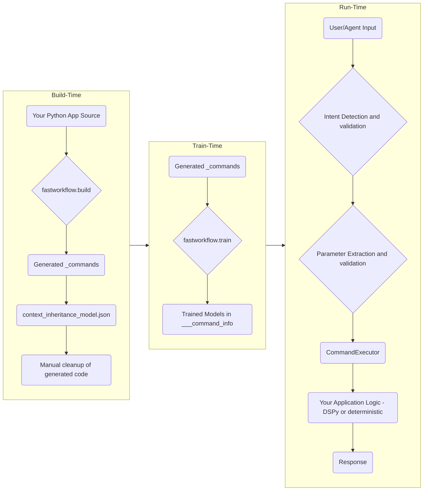
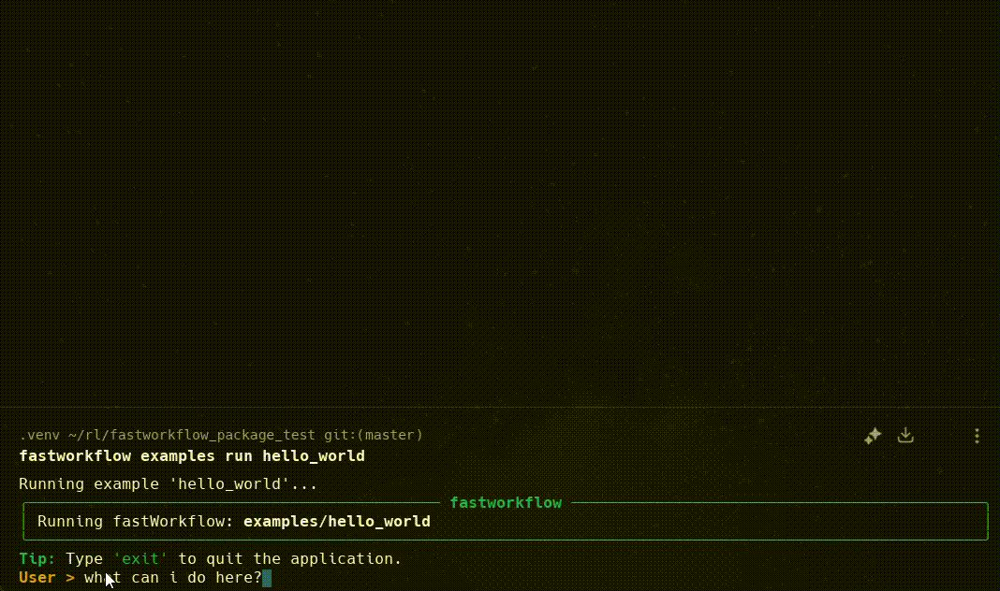

<!-- Logo and Title -->


[](LICENSE) [](<LINK_TO_CI>)

Build agents and assistants for complex workflows and large-scale Python applications, with deterministic or AI-powered business logic.

If you have tried AI enabling non-trivial applications, you have struggled with the following:
- AI assistants misunderstanding your intent and not adapting to your vocabulary and commands
- AI agents calling the wrong tools, or getting lost amid complex call chains and workflows
- Hallucinations in parameter extraction for tool calls
- Challenges supporting humans, agents, and client code at the same time

While [DSPy](https://dspy.ai) ([Why DSPy](https://x.com/lateinteraction/status/1921565300690149759)) is an amazing framework for optimizing LLM generation, we need an application framework that understands the concepts of DSPy (signatures, modules, optimization) and layers functionality on top to address the above challenges.

---

### Why fastWorkflow?

- ✅ **Unlimited Tool Scaling**: fastworkflow can scale to an unlimited number of tools
- ✅ **Cost-Effective Performance**: fastWorkFlow with small, free models can match the quality of large expensive models
- ✅ **Reliable Tool Execution**: fastworkflow validation pipeline virtually eliminates incorrect tool calling or parameter extraction, ensuring a reliable tool response
- ✅ **Adaptive Learning**: 1-shot learning from intent detection mistakes. It learns your conversational vocabulary as you interact with it
- ✅ **Interface Flexibility**: Support programmatic, assistant-driven and agent-driven interfaces with the same codebase
- ✅ **Deep Code Understanding**: fastworkflow understands classes, methods, inheritance and aggregation so you can quickly 'AI-enable' large-scale Python applications

---

##### Mistral Small agent tackling a complex command from Tau Bench Retail

<p align="center">
  
</p>

---

### Key Concepts

**Adaptive Intent Understanding**: Misunderstandings are a given in any conversation, no matter how intelligent the participants. Natural language applications should have intent clarification and parameter validation built-in. We have the ability to 1-shot adapt our semantic understanding of words and sentences based on the context of the conversation and clarifications of intent. Applications should also be able to do the same.

**Contextual Hierarchies**: Communication is always within a context. And not just one concept but layers of contexts. Interpretation starts with the narrowest context and expands to larger contexts if the narrow context does not 'fit' the interpretation. In programming languages, we express contexts as classes, tools as methods and context hierarchies using inheritance and aggregation. Natural language applications should understand classes, methods, inheritance and aggregation out-of-the-box.

**Signatures**: Signatures (ALA [Pydantic](https://docs.pydantic.dev/latest/) and [DSPy](https://dspy.ai)) are the most efficient way of mapping natural language commands to tool implementations, whether programmatic or GenAI. We use signatures as a backbone for implementing commands, enabling seamless integration with DSPy for producing LLM-content within a deterministic programming framework.

**Code Generation**: AI-enabling large-scale, complex applications is non-trivial. Build tools that can quickly map natural language commands to application classes and methods are critical if we are to build more than prototypes and demos.

**Context Navigation at Runtime**: Classes maintain state, not just methods. Method behaviors can change based on state. These capabilities are the building blocks for creating complex finite-state-machines on which non-trivial workflows are built. We need to support dynamically enabling/disabling methods along with the ability to navigate object instance hierarchies at run-time, if we want to build complex workflows.

---

## Table of Contents

- [Architecture Overview](#architecture-overview)
- [Installation](#installation)
- [Quick Start: Running an Example in 5 Minutes](#quick-start-running-an-example-in-5-minutes)
    - [Step 1: Fetch the `hello_world` Example](#step-1-fetch-the_hello_world-example)
    - [Step 2: Add Your API Keys](#step-2-add-your-api-keys)
    - [Step 3: Train the Example](#step-3-train-the-example)
    - [Step 4: Run the Example](#step-4-run-the-example)
- [CLI Command Reference](#cli-command-reference)
    - [Examples Management](#examples-management)
    - [Workflow Operations](#workflow-operations)
- [Understanding the Directory Structure](#understanding-the-directory-structure)
- [Building Your First Workflow: The Manual Approach](#building-your-first-workflow-the-manual-approach)
    - [Step 1: Create a new project directory](#step-1-create-a-new-project-directory)
    - [Step 2: Create a new application directory](#step-2-create-a-new-application-directory)
    - [Step 3: Design Your Application](#step-3-design-your-application)
    - [Step 4: Write the Command File](#step-4-write-the-command-file)
    - [Step 5: Setup the env and password files](#step-5-setup-the-env-and-password-files)
    - [Step 6: Train and Run](#step-6-train-and-run)
- [Refining Your Workflow](#refining-your-workflow)
    - [Calling class methods and initializing the class instance to set the context](#calling-class-methods-and-initializing-the-class-instance-to-set-the-context)
    - [Adding class inheritance with command_context_model.json](#adding-class-inheritance-with-command_context_modeljson)
    - [Adding context hierarchies with context_inheritance_model.json](#adding-context-hierarchies-with-context_inheritance_modeljson)
    - [Using DSPy for Response Generation](#using-dspy-for-response-generation)
    - [Using Startup Commands and Actions](#using-startup-commands-and-actions)
- [Rapidly Building Workflows with the Build Tool](#rapidly-building-workflows-with-the-build-tool)
- [Environment Variables Reference](#environment-variables-reference)
    - [Environment Variables](#environment-variables)
    - [Password/API Key Variables](#passwordapi-key-variables)
- [Troubleshooting / FAQ](#troubleshooting--faq)
- [For Contributors](#for-contributors)
- [License](#license)

---

## Architecture Overview

`fastWorkflow` separates the build-time, train-time, and run-time concerns. The `build` tool creates a command interface from your code, the `train` tool builds NLP models to understand commands, and the `run` scripts execute the workflow.



---

## Installation

To get started, install `fastWorkflow` from PyPI using pip:

```sh
pip install fastworkflow
# Or with uv
uv pip install fastworkflow
```

**Notes:**
- `fastWorkflow` currently works on Linux and MacOS only. On windows, use WSL.
- `fastWorkflow` installs PyTorch as a dependency. If you don't already have PyTorch installed, this could take a few minutes depending on your internet speed.
- `fastWorkflow` requires Python 3.11+ or higher.

---

## Quick Start: Running an Example in 5 Minutes

This is the fastest way to see `fastWorkflow` in action.
<p align="center">
  
</p>

### Step 1: Fetch the `hello_world` Example

The `fastworkflow` command-line tool can fetch bundled examples:

```sh
fastworkflow examples fetch hello_world
```
This command will:
1. Copy the `hello_world` example into a new `./examples/hello_world/` directory.
2. Copy the environment files to `./examples/fastworkflow.env` and `./examples/fastworkflow.passwords.env`.

### Step 2: Add Your API Keys

The example workflows require API keys for the LLM models. Edit the `./examples/fastworkflow.passwords.env` file:

```sh
# Edit the passwords file to add your API keys
nano ./examples/fastworkflow.passwords.env
```

You'll need to add at least:
```
LITELLM_API_KEY_SYNDATA_GEN=your-mistral-api-key
LITELLM_API_KEY_PARAM_EXTRACTION=your-mistral-api-key
LITELLM_API_KEY_RESPONSE_GEN=your-mistral-api-key
LITELLM_API_KEY_PLANNER=your-mistral-api-key
LITELLM_API_KEY_AGENT=your-mistral-api-key
```

You can get a free API key from [Mistral AI](https://mistral.ai) - the example is configured to use the `mistral-small-latest` model which is available on their free tier.

### Step 3: Train the Example

Train the intent-detection models for the workflow:

```sh
fastworkflow examples train hello_world
```

This step builds the NLP models that help the workflow understand user commands.

### Step 4: Run the Example

Once training is complete, run the interactive assistant:

```sh
fastworkflow examples run hello_world
```

You will be greeted with a `User >` prompt. Try it out by asking "what can you do?" or "add 49 + 51"!

To see other available examples, run `fastworkflow examples list`.

---

## CLI Command Reference

The `fastworkflow` CLI provides several commands to help you work with workflows:

### Examples Management

```sh
# List available examples
fastworkflow examples list

# Fetch an example to your local directory
fastworkflow examples fetch <example_name>

# Train an example workflow
fastworkflow examples train <example_name>

# Run an example workflow
fastworkflow examples run <example_name>
```

### Workflow Operations

```sh
# Build a workflow from your Python application
fastworkflow build --app-dir <app_dir> --workflow-folderpath <workflow_dir>

# Train a workflow's intent detection models
fastworkflow train <workflow_dir> <env_file> <passwords_file>

# Run a workflow
fastworkflow run <workflow_dir> <env_file> <passwords_file>
```

To run a workflow in agentic mode, add the `--run_as_agent` flag:

```sh
fastworkflow run <workflow_dir> <env_file> <passwords_file> --run_as_agent
```

Each command has additional options that can be viewed with the `--help` flag:

```sh
fastworkflow examples --help
fastworkflow build --help
fastworkflow train --help
fastworkflow run --help
```

---

## Understanding the Directory Structure

A key concept in `fastWorkflow` is the separation of your application's logic from the workflow commands definition.

```
messaging_app_1/                    # <-- The workflow_folderpath
├── application/                    # <-- Your application directory (not generated)
│   └── send_message.py             # <-- Your application code
│
├── _commands/                      # <-- Commands folder
│   └── send_message.py
|
├── context_inheritance_model.json  # <-- Inheritance model
|
├── ___command_info/                # <-- Metadata folder. Generated by the train tool
├── ___convo_info/                  # <-- Converation log. Generated at run-time
├── ___workflow_contexts/           # <-- Session data. Generated at run-time

fastworkflow.env                    # <-- Env file (copy from hello_world example)
fastworkflow.passwords.env          # <-- Passwords (copy from hello_world example)
```
- Your application code (`application/`) remains untouched.
- The `___command_info/` folder contains all the generated files and trained models. 
- The build tool parameter `--app-dir` points to your app code (`application/`)
- The build tool parameter `--workflow-folderpath` points to the workflow folderpath (`messaging_app_1`).

---

> [!tip]
> **Add to your `.gitignore`:**  
> Add the following folders to your `.gitignore` to avoid committing generated files or sensitive data:
> ```
> ___workflow_contexts
> ___command_info
> ___convo_info
> ```

---

## Building Your First Workflow: The Manual Approach

Before we automate everything with the build tool, let’s *hand-craft* the smallest possible workflow. Walking through each file once will make the generated output much easier to understand.

> [!tip]
> You can fetch messaging_app_1 code using `fastworkflow examples fetch messaging_app_1` if you want to skip writing the code 

### Step 1: Create a new project directory

```sh
mkdir -p messaging_app_1
```

### Step 2: Create a new application directory

```sh
mkdir -p messaging_app_1/application
```

### Step 3: Design Your Application

Create a simple function in `messaging_app_1/application/send_message.py`.

```python
def send_message(to: str, message: str) -> str:
    print(f"Sending '{message}' to {to}")
```

### Step 4: Write the Command File

Create a file named `messaging_app_1/_commands/send_message.py`. This file tells `fastWorkflow` how to handle the `send_message` command.

```python
import fastworkflow
from fastworkflow.train.generate_synthetic import generate_diverse_utterances
from pydantic import BaseModel, Field

from ..application.send_message import send_message

# the signature class defines our intent
class Signature:
    class Input(BaseModel):
        to: str = Field(
            description="Who are you sending the message to",
            examples=['jsmith@abc.com', 'jane.doe@xyz.edu'],
            pattern=r'^[a-zA-Z0-9_.+-]+@[a-zA-Z0-9-]+\.[a-zA-Z0-9-.]+$'
        )
        message: str = Field(
            description="The message you want to send",
            examples=['Hello, how are you?', 'Hi, reaching out to discuss fastWorkflow'],
            min_length=3,
            max_length=500
        )

    plain_utterances = [
        "Tell john@fastworkflow.ai that the build tool needs improvement",
    ]

    @staticmethod
    def generate_utterances(workflow: fastworkflow.Workflow, command_name: str) -> list[str]:
        """This function will be called by the framework to generate utterances for training"""
        return [
            command_name.split('/')[-1].lower().replace('_', ' ')
        ] + generate_diverse_utterances(Signature.plain_utterances, command_name)

# the response generator class processes the command
class ResponseGenerator:
    def _process_command(self, workflow: fastworkflow.Workflow, input: Signature.Input) -> None:
        """Helper function that actually executes the send_message function.
           It is not required by fastworkflow. You can do everything in __call__().
        """
        # Call the application function
        send_message(to=input.to, message=input.message)

    def __call__(self, workflow: 
                 fastworkflow.Workflow, 
                 command: str, 
                 command_parameters: Signature.Input) -> fastworkflow.CommandOutput:
        """The framework will call this function to process the command"""
        self._process_command(workflow, command_parameters)
        
        response = (
            f'Response: The message was printed to the screen'
        )

        return fastworkflow.CommandOutput(
            workflow_id=workflow.id,
            command_responses=[
                fastworkflow.CommandResponse(response=response)
            ]
        )
```

### Step 5: Setup the env and password files

- Make sure you have the examples folder from fetching the 'hello_world' workflow
- Copy fastworkflow.env from examples folder to ./messaging_app_1
- Copy fastworkflow.passwords.env from examples folder to ./messaging_app_1
    - Update the API keys for the LLM you are using in fastworkflow.passwords.env 

---

### Step 6: Train and Run

Your manual workflow is ready!
```sh
# Train the workflow
fastworkflow train ./messaging_app_1 ./messaging_app_1/fastworkflow.env ./messaging_app_1/fastworkflow.passwords.env

# Run the workflow
fastworkflow run ./messaging_app_1 ./messaging_app_1/fastworkflow.env ./messaging_app_1/fastworkflow.passwords.env
```

---

## Refining Your Workflow

### Calling class methods and initializing the class instance to set the context
This will allow you to move beyond a flat set of tools (global functions) and organize your tools into logical contexts that maintain state

- [Building stateful AI agents with fastworkflow - from functions to classes](fastworkflow-article-2.md)

### Adding class inheritance with command_context_model.json
If you have a non-trivial application, your AI agent will have to understand the inheritance relationships between different types of objects in your application

- [Leveraging class inheritance in fastWorkflow - building advanced AI agents](fastworkflow-article-3.md)

### Adding context hierarchies with context_inheritance_model.json
Contexts are layered! Command handling should start with the current context, but move up the context hierarchy when the current context cannot handle the command. Learn how to build sophisticated agentic applications that support context hierarchies and expose aggregation relationships in object models. 
- [Building complex context hierarchies in fastWorkflow - Advanced AI agents](fastworkflow-article-4.md)

---

### Using DSPy for Response Generation

fastWorkflow integrates seamlessly with DSPy to leverage LLM capabilities for response generation. The `dspy_utils.py` module provides a convenient bridge between Pydantic models and DSPy signatures:

```python
# In your command file
from fastworkflow.utils.dspy_utils import dspySignature
import dspy

class ResponseGenerator:
    def __call__(self, workflow, command_parameters: Signature.Input) -> fastworkflow.CommandOutput:
        # 1. Define your signature and dspy function
        dspy_signature_class = dspySignature(Signature.Input, Signature.Output)
        dspy_predict_func = dspy.Predict(dspy_signature_class)
        
        # 2. Get prediction from DSPy module
        prediction = dspy_predict_func(command_parameters)
        
        # 3. Create output directly using ** unpacking
        output = Signature.Output(**prediction)
        
        return fastworkflow.CommandOutput(
            command_responses=[
                fastworkflow.CommandResponse(response=output.model_dump_json())
            ]
        )
```

The `dspySignature` function automatically:

- Maps your Pydantic model fields to DSPy input/output fields
- Preserves field types (or converts to strings if `preserve_types=False`)
- Transfers field descriptions to DSPy for better prompting
- Generates instructions based on field metadata (defaults, examples)
- Handles optional fields correctly

This approach maintains type safety while benefiting from DSPy's optimization capabilities, allowing you to easily switch between deterministic logic and AI-powered responses without changing your command interface.

### Using Startup Commands and Actions

fastWorkflow supports initializing your workflow with a startup command or action when launching the application. This is useful for setting up the initial context, loading data, or performing any necessary initialization before user interaction begins.

#### Startup Commands

A startup command is a simple string that gets executed as if the user had typed it:

```sh
# Run with a startup command
fastworkflow run my_workflow/ .env passwords.env --startup_command "initialize project"
```

The startup command will be processed before any user input, and its output will be displayed to the user. This is ideal for simple initialization tasks like:
- Setting the initial context
- Loading default data
- Displaying welcome messages or available commands

#### Startup Actions

For more complex initialization needs, you can use a startup action defined in a JSON file:

```sh
# Run with a startup action defined in a JSON file
fastworkflow run my_workflow/ .env passwords.env --startup_action startup_action.json
```

The action JSON file should define a valid fastWorkflow Action object:

```json
{
  "command_context": "YourContextClass",
  "command_name": "initialize",
  "command_parameters": {
    "param1": "value1",
    "param2": "value2"
  }
}
```

Startup actions provide more control than startup commands because:
- They bypass the intent detection phase
- They can specify exact parameter values
- They target a specific command context directly

#### Important Notes

- You cannot use both `--startup_command` and `--startup_action` simultaneously
- Startup commands and actions are executed before the first user prompt appears
- If a startup command or action fails, an error will be displayed, but the application will continue running
- The `--keep_alive` flag (default: true) ensures the workflow continues running after the startup command completes

For workflows with complex initialization requirements, creating a dedicated startup or initialize command in your `_commands` directory is recommended.

> [!tip]
> **Running in Headless Mode:**  
> To run a workflow non-interactively (headless mode), provide a startup command or action and set `--keep_alive` to `False`:
> ```sh
> # Run a workflow that executes a command and exits
> fastworkflow run my_workflow/ .env passwords.env --startup_command "process data" --keep_alive False
> 
> # Or with a startup action file
> fastworkflow run my_workflow/ .env passwords.env --startup_action process_action.json --keep_alive False
> ```
> This is useful for scheduled tasks, CI/CD pipelines, or batch processing where you want the workflow to perform specific actions and terminate automatically when complete.

> [!tip]
> **Implementing a UI Chatbot using fastWorkflow:**  
> Refer to the fastworkflow.run.__main__.py file in fastworkflow's repo for a reference implementation of a the command loop. You can use this as a starting point to build your own UI chatbot.

---

## Rapidly Building Workflows with the Build Tool

After understanding the manual process, you can use the `fastworkflow build` command to automate everything. It introspects your code and generates all the necessary files.

Delete your manually created `_commands` directory and run:
```sh
fastworkflow build \
  --app-dir my_app/ \
  --workflow-folderpath my_workflow_ui/ \
  --overwrite
```
This single command will generate the `greet.py` command, `get_properties` and `set_properties` for any properties, the `context_inheritance_model.json`, and more, accomplishing in seconds what we did manually.

> [!tip]
> The build tool is a work in progress and is currently a one-shot tool. It also requires manually correcting the generated code. The plan is to morph it into a Copilot for building workflows. We can use fastWorkflow itself to implement this Copilot. Reach out if building this interests you.

---

## Environment Variables Reference

### Environment Variables

| Variable | Purpose | When Needed | Default |
|:---|:---|:---|:---|
| `SPEEDDICT_FOLDERNAME` | Directory name for workflow contexts | Always | `___workflow_contexts` |
| `LLM_SYNDATA_GEN` | LiteLLM model string for synthetic utterance generation | `train` | `mistral/mistral-small-latest` |
| `LLM_PARAM_EXTRACTION` | LiteLLM model string for parameter extraction | `train`, `run` | `mistral/mistral-small-latest` |
| `LLM_RESPONSE_GEN` | LiteLLM model string for response generation | `run` | `mistral/mistral-small-latest` |
| `LLM_PLANNER` | LiteLLM model string for the agent's task planner | `run` (agent mode) | `mistral/mistral-small-latest` |
| `LLM_AGENT` | LiteLLM model string for the DSPy agent | `run` (agent mode) | `mistral/mistral-small-latest` |
| `NOT_FOUND` | Placeholder value for missing parameters during extraction | Always | `"NOT_FOUND"` |
| `MISSING_INFORMATION_ERRMSG` | Error message prefix for missing parameters | Always | `"Missing required..."` |
| `INVALID_INFORMATION_ERRMSG` | Error message prefix for invalid parameters | Always | `"Invalid information..."` |

### Password/API Key Variables

| Variable | Purpose | When Needed | Default |
|:---|:---|:---|:---|
| `LITELLM_API_KEY_SYNDATA_GEN`| API key for the `LLM_SYNDATA_GEN` model | `train` | *required* |
| `LITELLM_API_KEY_PARAM_EXTRACTION`| API key for the `LLM_PARAM_EXTRACTION` model | `train`, `run` | *required* |
| `LITELLM_API_KEY_RESPONSE_GEN`| API key for the `LLM_RESPONSE_GEN` model | `run` | *required* |
| `LITELLM_API_KEY_PLANNER`| API key for the `LLM_PLANNER` model | `run` (agent mode) | *required* |
| `LITELLM_API_KEY_AGENT`| API key for the `LLM_AGENT` model | `run` (agent mode) | *required* |

> [!tip]
> The example workflows are configured to use Mistral's models by default. You can get a free API key from [Mistral AI](https://mistral.ai) that works with the `mistral-small-latest` model.

---

## Troubleshooting / FAQ

> **`PARAMETER EXTRACTION ERROR`**
> This means the LLM failed to extract the required parameters from your command. The error message will list the missing or invalid fields. Rephrase your command to be more specific.

> **`CRASH RUNNING FASTWORKFLOW`**
> This happens when the ___workflow_contexts folder gets corrupted. Delete it and run again.

> **Slow Training**
> Training involves generating synthetic utterances, which requires multiple LLM calls, making it inherently time-consuming. The first run may also be slow due to model downloads from Hugging Face. Subsequent runs will be faster. Set `export HF_HOME=/path/to/cache` to control where models are stored. Training a small workflow takes ~5-8 minutes on a modern CPU.

> **Missing API Keys**
> If you see errors about missing environment variables or API keys, make sure you've added your API keys to the `fastworkflow.passwords.env` file as described in the Quick Start guide.

> **Commands are not recognized**
> Check the command implementation for import or syntax errors. If the command module cannot be loaded, it will not show up

> [!tip]
> To debug command files and fastWorkflow code, set up vscode launch.json, set `justmycode` to False, add breakpoints, and run in debug mode

---

## For Contributors

Interested in contributing to `fastWorkflow` itself? Great!

1.  **Clone the repository:** `git clone https://github.com/your-repo/fastworkflow.git`
2.  **Set up the environment:** Create a virtual environment using your preferred tool (venv, uv, conda, poetry, etc.) with Python 3.11+
3.  **Install in editable mode with dev dependencies:** `pip install -e .` or `uv pip install -e ".[dev]"`
4.  **[Join our Discord](https://discord.gg/CCpNujh2):** Ask questions, discuss functionality, showcase your fastWorkflows

---

## Our work

- [Optimizing intent classifiction with a sentence transformer pipeline architecture - 1/2](https://medium.com/@adihbhatt04/optimizing-intent-classification-with-a-sentence-transformer-pipeline-architecture-part-2-pca-f353e68696ab)

- [Optimizing intent classifiction with a sentence transformer pipeline architecture - 2/2](https://medium.com/@adihbhatt04/optimizing-intent-classification-with-a-sentence-transformer-pipeline-architecture-part-1-586192b25d42)

- [Structured understanding - A comparative study of parameter extraction across leading llms](https://medium.com/@sanchitsatija55/structured-understanding-a-comparative-study-of-parameter-extraction-across-leading-llms-8e65b0333ddf)

- [A generalized parameter extraction framework](https://medium.com/@sanchitsatija55/a-generalized-parameter-extraction-framework-dab9adfd1eef)

---

## References

- [DSPy - Compiling Declarative Language Model Calls into Self-Improving Pipelines](https://arxiv.org/abs/2310.03714)

- [Position: LLMs Can’t Plan, But Can Help Planning in LLM-Modulo Frameworks](https://openreview.net/forum?id=Th8JPEmH4z)

- [Coherence statistics, self-generated experience and why young humans are much smarter than current AI](https://neurips.cc/virtual/2023/invited-talk/73992)

---

## License

`fastWorkflow` is released under the Apache License 2.0