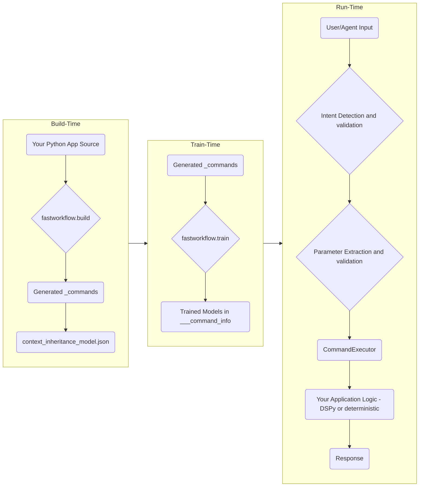

<!-- Logo and Title -->


[](LICENSE) [](<LINK_TO_CI>)

Build agents and assistants for complex workflows and large-scale Python applications, with deterministic or AI-powered business logic.

If you have tried AI enabling non-trivial applications, you have struggled with the following:
- AI assistants misunderstanding your intent and not adapting to your vocabulary and commands
- AI agents calling the wrong tools, or getting lost amid complex call chains and workflows
- Hallucinations in parameter extraction for tool calls
- Challenges supporting humans, agents, and client code at the same time

While [DSPy](https://dspy.ai) is an amazing framework for optimizing LLM generation, we need an application framework that understands the concepts of DSPy (signatures, modules, optimization) and layers functionality on top to address the above challenges.

---

### Why fastWorkflow?

- ✅ **Unlimited Tool Scaling**: fastworkflow can scale to an unlimited number of tools
- ✅ **Cost-Effective Performance**: fastWorkFlow with small, free models can match the quality of large expensive models
- ✅ **Reliable Tool Execution**: fastworkflow validation pipeline virtually eliminates incorrect tool calling or parameter extraction, ensuring a reliable tool response
- ✅ **Adaptive Learning**: 1-shot learning from intent detection mistakes. It learns your conversational vocabulary as you interact with it
- ✅ **Interface Flexibility**: Support programmatic, assistant-driven and agent-driven interfaces with the same codebase
- ✅ **Deep Code Understanding**: fastworkflow understands classes, methods, inheritance and aggregation so you can quickly 'AI-enable' large-scale Python applications

---

##### Mistral Small agent tackling a complex command from Tau Bench Retail

<p align="center">
  
</p>

---

### Key Concepts

**Adaptive Intent Understanding**: Misunderstandings are a given in any conversation, no matter how intelligent the participants. Natural language applications should have intent clarification and parameter validation built-in. We have the ability to 1-shot adapt our semantic understanding of words and sentences based on the context of the conversation and clarifications of intent. Applications should also be able to do the same.

**Contextual Hierarchies**: Communication is always within a context. And not just one concept but layers of contexts. Interpretation starts with the narrowest context and expands to larger contexts if the narrow context does not 'fit' the interpretation. In programming languages, we express contexts as classes, tools as methods and context hierarchies using inheritance and aggregation. Natural language applications should understand classes, methods, inheritance and aggregation out-of-the-box.

**Signatures**: Signatures (ALA [Pydantic](https://docs.pydantic.dev/latest/) and [DSPy](https://dspy.ai)) are the most efficient way of mapping natural language commands to tool implementations, whether programmatic or GenAI. We use signatures as a backbone for implementing commands, enabling seamless integration with DSPy for producing LLM-content within a deterministic programming framework.

**Code Generation**: AI-enabling large-scale, complex applications is non-trivial. Build tools that can quickly map natural language commands to application classes and methods are critical if we are to build more than prototypes and demos.

**Context Navigation at Runtime**: Classes maintain state, not just methods. Method behaviors can change based on state. These capabilities are the building blocks for creating complex finite-state-machines on which non-trivial workflows are built. We need to support dynamically enabling/disabling methods along with the ability to navigate object instance hierarchies at run-time, if we want to build complex workflows.

---

## Table of Contents

- [Architecture Overview](#architecture-overview)
- [Installation](#installation)
- [Quick Start: Running an Example in 5 Minutes](#quick-start-running-an-example-in-5-minutes)
    - [Step 1: Fetch the `hello_world` Example](#step-1-fetch-the-hello_world-example)
    - [Step 2: Add Your API Keys](#step-2-add-your-api-keys)
    - [Step 3: Train the Example](#step-3-train-the-example)
    - [Step 4: Run the Example](#step-4-run-the-example)
- [CLI Command Reference](#cli-command-reference)
    - [Examples Management](#examples-management)
    - [Workflow Operations](#workflow-operations)
- [Understanding the Directory Structure](#understanding-the-directory-structure)
- [Building Your First Workflow: The Manual Approach](#building-your-first-workflow-the-manual-approach)
    - [Step 1: Design Your Application](#step-1-design-your-application)
    - [Step 2: Create the Workflow Directory](#step-2-create-the-workflow-directory)
    - [Step 3: Write the Command File](#step-3-write-the-command-file)
    - [Step 4: Create the Context Model](#step-4-create-the-context-model)
    - [Step 5: Train and Run](#step-5-train-and-run)
- [Refining Your Workflow](#refining-your-workflow)
    - [Adding Inheritance](#adding-inheritance)
    - [Adding Context Hierarchies](#adding-context-hierarchies)
- [Rapidly Building Workflows with the Build Tool](#rapidly-building-workflows-with-the-build-tool)
- [Environment Variables Reference](#environment-variables-reference)
- [Troubleshooting / FAQ](#troubleshooting--faq)
- [For Contributors](#for-contributors)
- [License](#license)

---

## Architecture Overview

`fastWorkflow` separates the build-time, train-time, and run-time concerns. The `build` tool creates a command interface from your code, the `train` tool builds NLP models to understand commands, and the `run` scripts execute the workflow.



---

## Installation

To get started, install `fastWorkflow` from PyPI using pip:

```sh
pip install fastworkflow
# Or with uv
uv pip install fastworkflow
```

**Note:** `fastWorkflow` installs PyTorch as a dependency. If you don't already have PyTorch installed, this could take a few minutes depending on your internet speed.

---

## Quick Start: Running an Example in 5 Minutes

This is the fastest way to see `fastWorkflow` in action.
<p align="center">
  
</p>

### Step 1: Fetch the `hello_world` Example

The `fastworkflow` command-line tool can fetch bundled examples:

```sh
fastworkflow examples fetch hello_world
```
This command will:
1. Copy the `hello_world` example into a new `./examples/hello_world/` directory.
2. Copy the environment files to `./examples/fastworkflow.env` and `./examples/fastworkflow.passwords.env`.

### Step 2: Add Your API Keys

The example workflows require API keys for the LLM models. Edit the `./examples/fastworkflow.passwords.env` file:

```sh
# Edit the passwords file to add your API keys
nano ./examples/fastworkflow.passwords.env
```

You'll need to add at least:
```
LITELLM_API_KEY_SYNDATA_GEN=your-mistral-api-key
LITELLM_API_KEY_PARAM_EXTRACTION=your-mistral-api-key
LITELLM_API_KEY_RESPONSE_GEN=your-mistral-api-key
LITELLM_API_KEY_AGENT=your-mistral-api-key
```

You can get a free API key from [Mistral AI](https://mistral.ai) - the example is configured to use the `mistral-small-latest` model which is available on their free tier.

### Step 3: Train the Example

Train the intent-detection models for the workflow:

```sh
fastworkflow examples train hello_world
```

This step builds the NLP models that help the workflow understand user commands.

### Step 4: Run the Example

Once training is complete, run the interactive assistant:

```sh
fastworkflow examples run hello_world
```

You will be greeted with a `User >` prompt. Try it out by asking "what can you do?" or "add 49 + 51"!

To see other available examples, run `fastworkflow examples list`.

---

## CLI Command Reference

The `fastworkflow` CLI provides several commands to help you work with workflows:

### Examples Management

```sh
# List available examples
fastworkflow examples list

# Fetch an example to your local directory
fastworkflow examples fetch <example_name>

# Train an example workflow
fastworkflow examples train <example_name>

# Run an example workflow
fastworkflow examples run <example_name>
```

### Workflow Operations

```sh
# Build a workflow from your Python application
fastworkflow build --app-dir <app_dir> --workflow-folderpath <workflow_dir>

# Train a workflow's intent detection models
fastworkflow train <workflow_dir> <env_file> <passwords_file>

# Run a workflow
fastworkflow run <workflow_dir> <env_file> <passwords_file>
```

Each command has additional options that can be viewed with the `--help` flag:

```sh
fastworkflow examples --help
fastworkflow build --help
fastworkflow train --help
fastworkflow run --help
```

---

## Understanding the Directory Structure

A key concept in `fastWorkflow` is the separation of your application's logic from the workflow UI definition.

```
my-project/
├── greeter_application/            # <-- Your application's Python package
│   ├── __init__.py
│   └── greeter.py
│
├── greeter_fastworkflow/           # <-- The fastWorkflow definition
│    |
│    ├── commands/                  # <-- Generated by the build tool
│    │   ├── Greeter/
│    │   │   └── greet.py
│    │   └── startup.py
│    |
│    ├── command_info/              # <-- Generated by the train tool
│    │   ├── Greeter/
│    │   │   └── tinymodel.pth
│    │   └── ...
│    └── context_inheritance_model.json
│
├── env/                            # <-- Project environment
|    └── fastworkflow.env
│
└── passwords/                      # <-- Project passwords
     └── fastworkflow.passwords.env
```
-   Your application code (`greeter_application/`) remains untouched.
-   The `fastWorkflow` definition (`greeter_fastworkflow/`) contains all the generated files and trained models. The build tool (`--app-dir`) points to your app code, while the output flag (`--workflow-folderpath`) points to the workflow directory.

---

> [!tip]
> **Add to your `.gitignore`:**  
> Add the following folders to your `.gitignore` to avoid committing generated files or sensitive data:
> ```
> ___workflow_contexts
> ___command_info
> ___convo_info
> ```

---

## Environment Variables Reference

### Environment Variables

| Variable | Purpose | When Needed | Default |
|:---|:---|:---|:---|
| `SPEEDDICT_FOLDERNAME` | Directory name for workflow contexts | Always | `___workflow_contexts` |
| `LLM_SYNDATA_GEN` | LiteLLM model string for synthetic utterance generation | `train` | `mistral/mistral-small-latest` |
| `LLM_PARAM_EXTRACTION` | LiteLLM model string for parameter extraction | `train`, `run` | `mistral/mistral-small-latest` |
| `LLM_RESPONSE_GEN` | LiteLLM model string for response generation | `run` | `mistral/mistral-small-latest` |
| `LLM_AGENT` | LiteLLM model string for the DSPy agent | `run_agent` | `mistral/mistral-small-latest` |
| `NOT_FOUND` | Placeholder value for missing parameters during extraction | Always | `"NOT_FOUND"` |
| `MISSING_INFORMATION_ERRMSG` | Error message prefix for missing parameters | Always | `"Missing required..."` |
| `INVALID_INFORMATION_ERRMSG` | Error message prefix for invalid parameters | Always | `"Invalid information..."` |

### Password/API Key Variables

| Variable | Purpose | When Needed | Default |
|:---|:---|:---|:---|
| `LITELLM_API_KEY_SYNDATA_GEN`| API key for the `LLM_SYNDATA_GEN` model | `train` | *required* |
| `LITELLM_API_KEY_PARAM_EXTRACTION`| API key for the `LLM_PARAM_EXTRACTION` model | `train`, `run` | *required* |
| `LITELLM_API_KEY_RESPONSE_GEN`| API key for the `LLM_RESPONSE_GEN` model | `run` | *required* |
| `LITELLM_API_KEY_AGENT`| API key for the `LLM_AGENT` model | `run_agent` | *required* |

> [!tip]
> The example workflows are configured to use Mistral's models by default. You can get a free API key from [Mistral AI](https://mistral.ai) that works with the `mistral-small-latest` model.

---

## Troubleshooting / FAQ

> **`PARAMETER EXTRACTION ERROR`**
> This means the LLM failed to extract the required parameters from your command. The error message will list the missing or invalid fields. Rephrase your command to be more specific.

> **Slow Training**
> Training involves generating synthetic utterances, which requires multiple LLM calls, making it inherently time-consuming. The first run may also be slow due to model downloads from Hugging Face. Subsequent runs will be faster. Set `export HF_HOME=/path/to/cache` to control where models are stored. Training a small workflow takes ~5-8 minutes on a modern CPU.

> **Missing API Keys**
> If you see errors about missing environment variables or API keys, make sure you've added your API keys to the `fastworkflow.passwords.env` file as described in the Quick Start guide.

---

## For Contributors

Interested in contributing to `fastWorkflow` itself? Great!

1.  **Clone the repository:** `git clone https://github.com/your-repo/fastworkflow.git`
2.  **Set up the environment:** Create a virtual environment using your preferred tool (venv, uv, conda, poetry, etc.) with Python 3.11+
3.  **Install in editable mode with dev dependencies:** `pip install -e ".[dev]"`

Please see `CONTRIBUTING.md` for our contribution guidelines and code of conduct.

---

## License

`fastWorkflow` is released under the Apache License 2.0. See [LICENSE](LICENSE) for details.