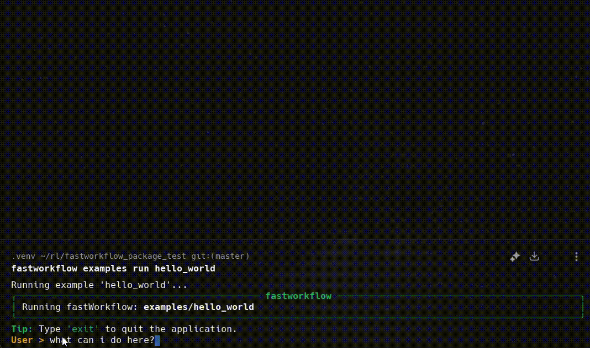
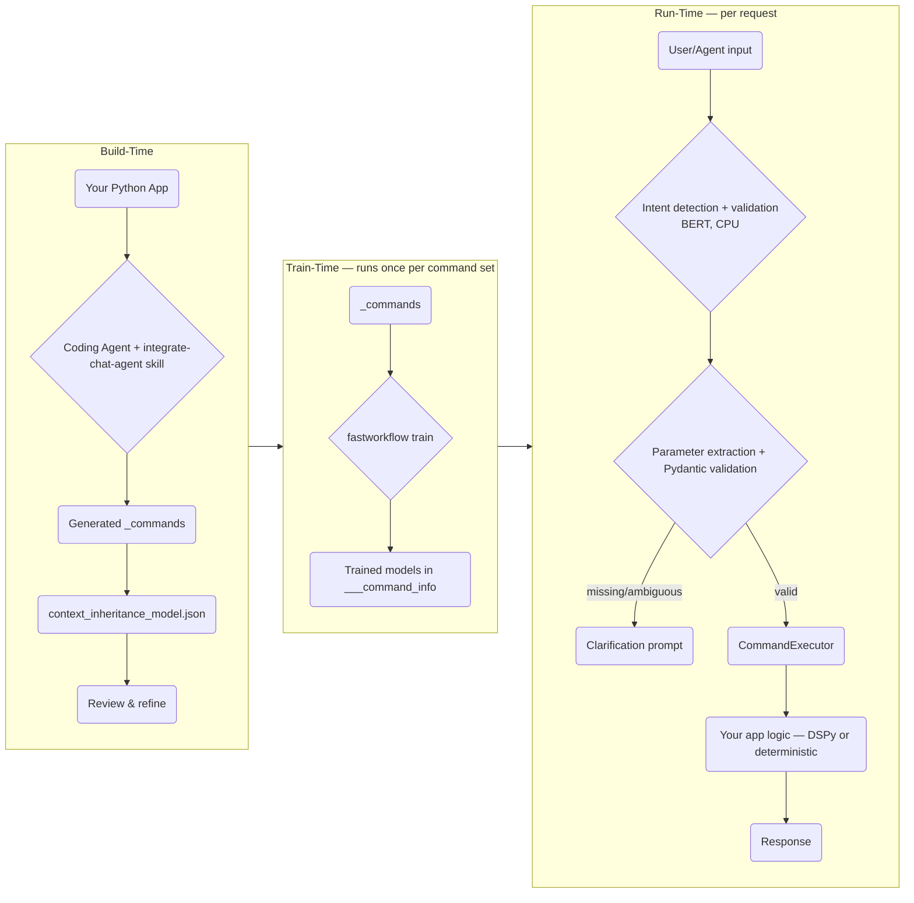

<!-- Logo and Title -->


[](LICENSE) [](https://pypi.org/project/fastworkflow/) [](https://github.com/radiantlogicinc/fastworkflow/actions) [](https://discord.gg/k2g58dDjYR)

**Build AI agents your application can actually trust in production — with small models cheaply, or frontier models more reliably.**

Most agent frameworks help you *build* an agent in an afternoon. fastWorkflow is for the moment after the demo, when you need the agent to stop calling the wrong tool, stop hallucinating parameters, and stop confidently doing the wrong thing on real, messy user input.

> **fastWorkflow improves agent reliability two ways:**
> 1. It lets **small, free models** (e.g. Mistral Small) perform far above their weight on structured workflows — matching frontier models on agentic benchmarks.
> 2. It makes **frontier models more reliable** by shrinking the active toolset, validating every parameter, and forcing clarification instead of silent wrong actions.

---

## The failure fastWorkflow exists to fix

You wire up a dozen tools to a capable frontier model. In dev, against clean prompts, it works great. Then real users show up:

```text
User: "cancel that blue jacket order from last week and give me credit, not a refund"

[ Generic tool-calling stack + frontier model ]
search_orders(query="blue jacket")                              ✓
cancel_order(order_id="44821")                                  ✓
process_refund(order_id="44821", method="original_payment")     ✗  ← user asked for store credit
```

Nothing crashed. The logs look fine. But the customer asked for **store credit** and got a refund to their card. This is the dangerous failure class: **plausible-looking, semantically wrong execution.** No amount of prompt engineering reliably prevents it at scale, because the problem is structural — ambiguous language, missing parameters, and a crowded toolset — not a weak model.

Here's the same request through fastWorkflow:

```text
User: "cancel that blue jacket order from last week and give me credit, not a refund"

[ fastWorkflow ]
Intent detected:      cancel_order
Parameter validation: order_id unresolved        → ask, don't guess

Agent: "I found two recent orders — #44821 (Blue Jacket, $89) and
        #44798 (Blue Scarf, $34). Which should I cancel?"
User:  "the jacket"

Parameter validation: refund_method = store_credit   ✓ (from "credit, not a refund")
cancel_order(order_id="44821", refund_method="store_credit")   ✓
notify_customer(order_id="44821")                              ✓
```

Same model. Same application code. Different execution discipline. **The framework makes the system harder to use incorrectly.**

---

## What fastWorkflow does differently

Instead of dumping your whole tool catalog into a prompt and hoping the model navigates it, fastWorkflow puts a structured execution layer between natural language and your application's side effects:

1. **Intent detection is trained locally** — a tiny BERT/DistilBERT classifier (runs on CPU, ~milliseconds) maps utterances to commands instead of relying entirely on the LLM to infer what the user "probably meant."
2. **Every parameter is validated** against your Pydantic `Field` definitions *before* your code runs — malformed or missing values are caught, not executed.
3. **Clarification is a first-class behavior** — when a required parameter is missing or ambiguous, the agent asks instead of guessing.
4. **Tools are organized into context hierarchies** — the model only ever sees the handful of tools relevant to the current state, never all 40 at once.
5. **Your application code stays the source of truth** — fastWorkflow *wraps* it; it never replaces or rewrites it.

---

## Why this helps frontier models too

A common reaction is: *"Nice for cheap small models, but I already use GPT-4o / Claude / Bedrock."* That's exactly where fastWorkflow still earns its place. Frontier models are better at language — but they still fail on the parts of agent systems that are **architectural, not linguistic**:

| Failure mode | What goes wrong | fastWorkflow's structural fix |
|---|---|---|
| **Tool overload** | Picks a valid-but-wrong tool from a crowded prompt | Context hierarchies keep the active toolset small |
| **Parameter overconfidence** | Extracts one slot wrong and executes anyway | Pydantic validation gate before execution |
| **State blindness** | Acts as if every tool is always available | Tools enabled/disabled by runtime context |
| **Ambiguity collapse** | Resolves uncertainty internally instead of asking | Clarification is built in, not prompted for |

With small models, fastWorkflow is mostly about **cost**. With large models, it's about **reliability and reducing expensive mistakes**. Either way, you get one consistent command layer for UI chat, backend automation, tests, and internal agents.

---

## Benchmark: small models, frontier-level reliability

fastWorkflow was benchmarked on [Tau Bench](https://github.com/sierra-research/tau-bench) — an industry-standard benchmark for conversational agents that complete realistic, multi-step, tool-using customer-service workflows (order management, flight rebooking, policy enforcement). This measures exactly what breaks in production: **reliable tool execution under ambiguity**, not generic chat quality.

<p align="center">
  <table>
    <tr>
      <td align="center" width="50%">
        
        <br/><em>Retail: orders, returns, account operations</em>
      </td>
      <td align="center" width="50%">
        
        <br/><em>Airline: rebooking, baggage, loyalty workflows</em>
      </td>
    </tr>
  </table>
</p>

**fastWorkflow with Mistral Small (free tier) matches frontier models on these structured workflows** — because the validation pipeline outweighs raw model capability where it counts.

> **Citation:** Sanchit Satija, Aditya Bhatt, Priyanshu Jani, and Dhar Rawal. 2026. *fastWorkflow: Closing the Performance Gap Between Small and Frontier Language Models for Conversational Agents.* In *Proceedings of the ACM Conference on AI Systems (CAIS '26)*. ACM, San Jose, CA, USA, 161–180. https://doi.org/10.1145/3786335.3813158

##### Mistral Small handling a complex Tau Bench Retail command

<p align="center">
  
</p>

---

## Table of Contents

- [Quick Start: run an example in 5 minutes](#quick-start-run-an-example-in-5-minutes)
- [AI-enable your own app (without restructuring it)](#ai-enable-your-own-app-without-restructuring-it)
- [How complex workflows scale: context hierarchies](#how-complex-workflows-scale-context-hierarchies)
- [Production deployment](#production-deployment)
- [Developer FAQ](#developer-faq)
- [Key concepts (going deeper)](#key-concepts-going-deeper)
- [Architecture overview](#architecture-overview)
- [Installation](#installation)
- [CLI reference](#cli-reference)
- [Environment variables reference](#environment-variables-reference)
- [Troubleshooting / FAQ](#troubleshooting--faq)
- [For contributors](#for-contributors)
- [Our work & references](#our-work--references)
- [License](#license)

---

## Quick Start: run an example in 5 minutes

This is the fastest way to see fastWorkflow in action.

<p align="center">
  
</p>

```sh
# 1. Install (Linux/macOS; on Windows use WSL. Python 3.11+)
pip install fastworkflow

# 2. Fetch the hello_world example + env file templates
fastworkflow examples fetch hello_world

# 3. Add your API key (a free Mistral key works for every role)
nano ./examples/fastworkflow.passwords.env

# 4. Build the intent models for this command set (one-time, ~5 min on CPU)
fastworkflow train ./examples/hello_world ./examples/fastworkflow.env ./examples/fastworkflow.passwords.env

# 5. Run it
fastworkflow run ./examples/hello_world ./examples/fastworkflow.env ./examples/fastworkflow.passwords.env
```

You'll get a `User >` prompt. Try **"what can you do?"** or **"add 49 + 51"**. Run `fastworkflow examples list` to see the rest.

> [!note]
> **"Train" doesn't mean GPUs or fine-tuning a foundation model.** `fastworkflow train` is closer to *compiling a conversational interface*: it generates synthetic utterances and fits small BERT-class intent classifiers for your commands. You run it once per command set, re-run it only when commands change, ship the resulting artifacts with your app, and need **no GPU at runtime**.

> [!tip]
> Get a free API key from [Mistral AI](https://mistral.ai) (works with `mistral-small-latest`) or [OpenRouter](https://openrouter.ai/openai/gpt-oss-20b:free). You can assign different models to different roles in the same workflow.

---

## AI-enable your own app (without restructuring it)

You do **not** rewrite your application around fastWorkflow. You wrap your existing code with thin command files. Say you already have this service:

```python
# your_app/orders.py  ← your existing code, untouched
class OrderService:
    def cancel_order(self, order_id: str, refund_method: str) -> dict: ...
    def get_order_status(self, order_id: str) -> dict: ...
    def update_shipping_address(self, order_id: str, address: str) -> dict: ...
```

### Recommended: let a coding agent wrap it for you

The fastest path for a non-trivial app is the **[integrate-chat-agent](./fastworkflow/docs/integrate-chat-agent) skill** with Cursor or Claude Code:

```text
Open fastworkflow/docs/integrate-chat-agent/SKILL.md
Prompt: "Integrate a fastWorkflow chat agent for OrderService in orders.py"
```

The agent introspects your code and generates `_commands/cancel_order.py`, `_commands/get_order_status.py`, the `context_inheritance_model.json`, and env scaffolding — then trains and smoke-tests it with you. **Your `orders.py` is never modified.**

### Or write a command wrapper by hand (~5 minutes per command)

```python
# _commands/cancel_order.py  ← new file; wraps your existing code
import fastworkflow
from fastworkflow.train.generate_synthetic import generate_diverse_utterances
from pydantic import BaseModel, Field

from your_app.orders import OrderService


class Signature:
    class Input(BaseModel):
        order_id: str = Field(
            description="The order ID to cancel",
            examples=["44821", "ORD-2024-001"],
            default="NOT_FOUND",          # missing → fastWorkflow asks instead of guessing
        )
        refund_method: str = Field(
            description="How to refund the customer",
            examples=["store_credit", "original_payment"],
            default="original_payment",
        )

    plain_utterances = [
        "Cancel order #44821 and give store credit",
        "cancel that blue jacket order, I want credit not a refund",
    ]

    @staticmethod
    def generate_utterances(workflow: fastworkflow.Workflow, command_name: str) -> list[str]:
        return [command_name.split("/")[-1].lower().replace("_", " ")] + \
            generate_diverse_utterances(Signature.plain_utterances, command_name)


class ResponseGenerator:
    def __call__(
        self,
        workflow: fastworkflow.Workflow,
        command: str,
        command_parameters: Signature.Input,
    ) -> fastworkflow.CommandOutput:
        result = OrderService().cancel_order(
            order_id=command_parameters.order_id,
            refund_method=command_parameters.refund_method,
        )
        return fastworkflow.CommandOutput(
            command_responses=[fastworkflow.CommandResponse(response=str(result))]
        )
```

Then `fastworkflow train` and `fastworkflow run` against your workflow directory. That's the entire integration pattern: a thin command layer over code you already have.

> [!tip]
> Prefer to learn by building the smallest possible workflow by hand first? `fastworkflow examples fetch messaging_app_1` is a minimal, fully-worked single-command workflow you can read end-to-end.

---

## How complex workflows scale: context hierarchies

At 5 tools, a frontier model is reliable. At 40 — a realistic enterprise workflow — accuracy drops: the model sees every tool in the prompt and starts choosing valid-but-wrong ones.

fastWorkflow keeps the active toolset small by modeling your application's object model as **contexts**. The agent only sees tools relevant to the *current* context:

```text
User                                ← always visible
├── search_orders()
├── get_customer_info()
│
└── Order        (active once an order is selected)
    ├── cancel_order()
    ├── update_address()
    │
    └── Refund   (active during a refund flow)
        ├── issue_store_credit()
        ├── issue_original_payment()
        └── escalate_to_human()
```

Context relationships live in **one file**, `context_inheritance_model.json` — not code. Each entry uses `base` (parent contexts whose commands are inherited) and optionally `/` (commands declared directly on the context):

```json
{
  "Order": {
    "base": ["User"]
  },
  "Refund": {
    "base": ["Order"]
  }
}
```

This is what lets small models stay accurate as your app grows — and what keeps frontier models from drowning in tool definitions.

---

## Production deployment

### Pattern 1 — host it as a FastAPI service (recommended)

Expose your workflow over HTTP with JWT auth, SSE/NDJSON streaming, and MCP support:

```sh
pip install "fastworkflow[server]"

python -m fastworkflow.run_fastapi_mcp \
  --workflow_path ./order_agent \
  --env_file_path ./fastworkflow.env \
  --passwords_file_path ./fastworkflow.passwords.env \
  --port 8000
```

Key endpoints: `/initialize` (create session + JWT), `/invoke_agent`, `/invoke_agent_stream` (SSE/NDJSON), `/invoke_assistant` (deterministic, non-agentic), `/perform_action` (direct programmatic calls), `/new_conversation`, `/conversations`, `/probes/healthz`, `/probes/readyz`.

### Pattern 2 — embed the core in an existing app

The execution core is synchronous and transport-free. Create one `WorkflowExecutionContext` per session and call `process_message` per turn:

```python
import fastworkflow
from dotenv import dotenv_values
from fastworkflow.workflow_execution_context import WorkflowExecutionContext

# Load env + secrets once at startup
env_vars = {
    **dotenv_values("fastworkflow.env"),
    **dotenv_values("fastworkflow.passwords.env"),
}
fastworkflow.init(env_vars=env_vars)

# One context + bound workflow per session
ctx = WorkflowExecutionContext(run_as_agent=True, session_key="user-123")
app_workflow = fastworkflow.Workflow.create("./order_agent", workflow_id_str="user-123")
ctx.bind_app_workflow(app_workflow)

@app.post("/chat")
def chat(message: str):
    output = ctx.process_message(message)        # synchronous; run in a worker thread under async
    return {"response": output.command_responses[0].response}
```

### Pattern 3 — Kubernetes

The service ships liveness/readiness probes out of the box. `/probes/readyz` returns `503` until the intent models are loaded, so traffic isn't routed before the agent is actually ready:

```yaml
livenessProbe:
  httpGet: { path: /probes/healthz, port: 8000 }
  initialDelaySeconds: 10
  periodSeconds: 10
readinessProbe:
  httpGet: { path: /probes/readyz, port: 8000 }
  initialDelaySeconds: 5
  periodSeconds: 5
```

---

## Developer FAQ

**Do I need a GPU?**
No. Intent detection (BERT/DistilBERT) runs on CPU in milliseconds. LLM calls go to whatever API you configure.

**Does training re-run on every deploy?**
No. `fastworkflow train` runs once per command set and writes artifacts to `___command_info/`. Bake those into your Docker image or CI artifact store; re-train only when you add or change commands.

**What actually ships to production?**
Your application code + your `_commands/` wrappers + the trained `___command_info/` artifacts (small BERT checkpoints). No GPU at runtime.

**Can I use Claude / GPT-4o / Bedrock instead of Mistral?**
Yes. fastWorkflow uses LiteLLM, so any provider works — set e.g. `LLM_AGENT=openai/gpt-4o` in `fastworkflow.env`. You can use different models for different roles (intent vs. extraction vs. response vs. planning).

**Can I route through a corporate LiteLLM proxy?**
Yes — prefix models with `litellm_proxy/` and set `LITELLM_PROXY_API_BASE`. See [Using LiteLLM Proxy](#using-litellm-proxy).

**What if a user asks something out of scope?**
Intent detection returns low confidence and fastWorkflow surfaces a clarification — it does not hallucinate a tool call. That's the core reliability guarantee.

**Can commands call REST APIs or databases, not just Python functions?**
Yes. `ResponseGenerator.__call__` is plain Python — call `requests`, `httpx`, an ORM, gRPC stubs, anything. fastWorkflow owns the NLP layer; your business logic is unrestricted.

---

## Key concepts (going deeper)

**Adaptive intent understanding** — Misunderstandings happen in every conversation. fastWorkflow does 1-shot adaptation from intent-detection mistakes, learning your conversational vocabulary as you interact; corrections can be persisted to improve the model across sessions.

**Signatures** — Pydantic `BaseModel` + `Field` (à la [DSPy](https://dspy.ai)) is the contract between natural language and your code. Strong descriptions and `examples` directly improve extraction accuracy, and the same schema feeds DSPy integration.

**Context navigation at runtime** — Classes hold state; method availability can change with state. fastWorkflow enables/disables commands and navigates object hierarchies at run-time, which is what makes complex, finite-state workflows possible.

**Deep code understanding** — fastWorkflow understands classes, methods, inheritance, and aggregation, so you can AI-enable large-scale Python applications by mapping them onto contexts and commands.

**DSPy for response generation** — use `dspy.Predict` inside `ResponseGenerator` when deterministic logic isn't enough; `dspySignature` bridges your Pydantic models to DSPy signatures while preserving types, descriptions, and examples:

```python
from fastworkflow.utils.dspy_utils import dspySignature
import dspy

dspy_sig = dspySignature(Signature.Input, Signature.Output)
prediction = dspy.Predict(dspy_sig)(command_parameters)
```

**Startup commands & headless mode** — initialize context or run non-interactively (batch/CI) by combining a startup command/action with `--keep_alive False`:

```sh
fastworkflow run my_workflow/ .env passwords.env \
  --startup_command "process daily report" --keep_alive False
```

Deep-dive articles:
- [From functions to classes: building stateful AI agents](fastworkflow-article-2.md)
- [Leveraging class inheritance in fastWorkflow](fastworkflow-article-3.md)
- [Building complex context hierarchies](fastworkflow-article-4.md)

---

## Architecture overview

fastWorkflow separates **build-time**, **train-time**, and **run-time**. At build-time you create a command interface from your code (recommended via the [integrate-chat-agent](./fastworkflow/docs/integrate-chat-agent) skill). `train` builds the NLP models; `run` executes the workflow. Your existing code is never modified — fastWorkflow sits as a layer on top.


```mermaid
graph LR
    subgraph A[Build-Time]
        A1(Your Python App) --> A2{Coding Agent + integrate-chat-agent skill};
        A2 --> A3(Generated _commands);
        A3 --> A4(context_inheritance_model.json);
        A4 --> A5(Review & refine);
    end

    subgraph B[Train-Time — runs once per command set]
        B1(_commands) --> B2{fastworkflow train};
        B2 --> B3(Trained models in ___command_info);
    end

    subgraph C[Run-Time — per request]
        C1(User/Agent input) --> C2{Intent detection + validation\nBERT, CPU};
        C2 --> C3{Parameter extraction + Pydantic validation};
        C3 -->|missing/ambiguous| C4(Clarification prompt);
        C3 -->|valid| C5(CommandExecutor);
        C5 --> C6(Your app logic — DSPy or deterministic);
        C6 --> C7(Response);
    end

    A --> B --> C
```

### Directory structure

```
order_agent/                         # <-- The workflow_folderpath
├── application/                     # <-- Your app code (untouched)
│   └── orders.py
├── _commands/                       # <-- Command wrappers (generated + edited)
│   ├── cancel_order.py
│   └── context_inheritance_model.json
├── ___command_info/                 # <-- Trained models (generated by `train`)
├── ___convo_info/                   # <-- Conversation logs (run-time)
└── ___workflow_contexts/            # <-- Session state (run-time)

fastworkflow.env                     # model strings, logging, intent model ids
fastworkflow.passwords.env           # API keys
```

> [!tip]
> Add `___workflow_contexts`, `___command_info`, and `___convo_info` to your `.gitignore`.

---

## Installation

```sh
pip install fastworkflow              # core (CPU inference, plain litellm client)
pip install "fastworkflow[server]"    # adds the FastAPI/MCP HTTP service
pip install "fastworkflow[training]"  # adds HuggingFace datasets for the train step
# Or with uv: uv pip install fastworkflow
```

**Notes**
- Linux/macOS only — on Windows use WSL. Python 3.11+.
- Installs PyTorch; the first install may take a few minutes.
- `fastworkflow train` needs the optional HuggingFace `datasets` package (`pip install datasets`, or `poetry install --with dev` from this repo).

The core depends on **plain** `litellm` (client only — no proxy server stack), so it co-installs cleanly with downstream apps that pin a plain `litellm`. Server-only deps live behind the `server` extra.

### Dependency compatibility

| Package | Supported range | Notes |
|---|---|---|
| `transformers` | `>=4.48.2,<6.0.0` | Works on transformers 5.x (BERT/DistilBERT load natively) |
| `dspy` | `>=3.0.1,<4.0.0` | DSPy 3.x API |
| `openai` | `>=2.8.0` | Compatible with openai 2.x |
| `litellm` | `>=1.83.7,<2.0.0` | Client only; FastAPI server deps are in the `server` extra |
| `sentence-transformers` | not a dependency | imposes no constraint downstream |

The intent-detection base models are configurable via `INTENT_DETECTION_TINY_MODEL` / `INTENT_DETECTION_LARGE_MODEL`.

---

## CLI reference

```sh
# Examples
fastworkflow examples list
fastworkflow examples fetch hello_world

# Train intent-detection models (once per command set)
fastworkflow train <workflow_dir> <env_file> <passwords_file>

# Run — agentic mode is the default
fastworkflow run <workflow_dir> <env_file> <passwords_file>
fastworkflow run <workflow_dir> <env_file> <passwords_file> --assistant   # deterministic, non-agentic

# Headless (batch/CI)
fastworkflow run <workflow_dir> <env_file> <passwords_file> \
  --startup_command "your command" --keep_alive False

# Host as a FastAPI/MCP service
python -m fastworkflow.run_fastapi_mcp --workflow_path ./wf --port 8000
```

> [!tip]
> Prefix a natural-language command with `/` during an interactive run to force deterministic (non-agentic) execution. Add `--help` to any command for its full options.

---

## Environment variables reference

Two files per workflow (templates ship with `fastworkflow examples fetch`).

### `fastworkflow.env`

| Variable | Purpose | When needed | Default |
|:---|:---|:---|:---|
| `SPEEDDICT_FOLDERNAME` | Directory name for workflow contexts | Always | `___workflow_contexts` |
| `LOG_LEVEL` | Log level (`DEBUG`…`CRITICAL`) | Optional | `INFO` |
| `LLM_SYNDATA_GEN` | Model for synthetic utterance generation | `train` | `mistral/mistral-small-latest` |
| `LLM_PARAM_EXTRACTION` | Model for parameter extraction | `train`, `run` | `mistral/mistral-small-latest` |
| `LLM_RESPONSE_GEN` | Model for response generation | `run` | `mistral/mistral-small-latest` |
| `LLM_PLANNER` | Model for the agent's task planner | `run` (agent) | `mistral/mistral-small-latest` |
| `LLM_AGENT` | Model for the DSPy agent | `run` (agent) | `mistral/mistral-small-latest` |
| `LLM_CONVERSATION_STORE` | Model for conversation topic/summary | FastAPI service | `mistral/mistral-small-latest` |
| `LITELLM_PROXY_API_BASE` | LiteLLM Proxy URL | with `litellm_proxy/` models | *not set* |
| `INTENT_DETECTION_TINY_MODEL` | HF id for the small intent model | `train` (optional) | `google/bert_uncased_L-4_H-128_A-2` |
| `INTENT_DETECTION_LARGE_MODEL` | HF id for the large intent model | `train` (optional) | `distilbert-base-uncased` |

### `fastworkflow.passwords.env`

| Variable | For | When needed |
|:---|:---|:---|
| `LITELLM_API_KEY_SYNDATA_GEN` | `LLM_SYNDATA_GEN` | `train` |
| `LITELLM_API_KEY_PARAM_EXTRACTION` | `LLM_PARAM_EXTRACTION` | `train`, `run` |
| `LITELLM_API_KEY_RESPONSE_GEN` | `LLM_RESPONSE_GEN` | `run` |
| `LITELLM_API_KEY_PLANNER` | `LLM_PLANNER` | `run` (agent) |
| `LITELLM_API_KEY_AGENT` | `LLM_AGENT` | `run` (agent) |
| `LITELLM_API_KEY_CONVERSATION_STORE` | `LLM_CONVERSATION_STORE` | FastAPI service |
| `LITELLM_PROXY_API_KEY` | shared LiteLLM Proxy key | with `litellm_proxy/` models |

### Using LiteLLM Proxy

Route LLM calls through a [LiteLLM Proxy](https://docs.litellm.ai/docs/simple_proxy) to centralize keys or unify providers — prefix model strings with `litellm_proxy/`:

```sh
# fastworkflow.env
LLM_AGENT=litellm_proxy/bedrock_mistral_large_2407
LITELLM_PROXY_API_BASE=http://127.0.0.1:4000
# fastworkflow.passwords.env
LITELLM_PROXY_API_KEY=your-proxy-api-key
```

When a model uses the `litellm_proxy/` prefix, the per-role keys are ignored and the shared proxy key is used. You can mix proxied and direct models.

---

## Troubleshooting / FAQ

> **`PARAMETER EXTRACTION ERROR`** — the LLM couldn't extract a required parameter. Rephrase more specifically, or strengthen the `Field(description=…, examples=[…])` in your Signature.

> **`CRASH RUNNING FASTWORKFLOW`** — the `___workflow_contexts` folder is corrupted. Delete it and re-run.

> **Slow first training run** — the first run downloads BERT/DistilBERT from HuggingFace and makes LLM calls for synthetic-utterance generation. Set `HF_HOME=/path/to/cache` to control model storage; later runs skip the download. A small workflow trains in ~5–8 minutes on CPU.

> **Commands not recognized** — a command module with an import/syntax error won't load and won't appear as an intent. Check your `_commands/*.py` files.

> [!tip]
> To debug command files, set up a VSCode `launch.json` with `justMyCode: false`, add breakpoints, and run in debug mode.

---

## For contributors

```sh
git clone https://github.com/radiantlogicinc/fastworkflow.git
cd fastworkflow
python -m venv .venv && source .venv/bin/activate
pip install -e ".[dev]"
```

[Join our Discord](https://discord.gg/k2g58dDjYR) — ask questions, discuss functionality, and showcase your fastWorkflows.

---

## Our work & references

- [Optimizing intent classification with a sentence-transformer pipeline — Part 1](https://medium.com/@adihbhatt04/optimizing-intent-classification-with-a-sentence-transformer-pipeline-architecture-part-2-pca-f353e68696ab)
- [Optimizing intent classification with a sentence-transformer pipeline — Part 2](https://medium.com/@adihbhatt04/optimizing-intent-classification-with-a-sentence-transformer-pipeline-architecture-part-1-586192b25d42)
- [Structured understanding: parameter extraction across leading LLMs](https://medium.com/@sanchitsatija55/structured-understanding-a-comparative-study-of-parameter-extraction-across-leading-llms-8e65b0333ddf)
- [A generalized parameter extraction framework](https://medium.com/@sanchitsatija55/a-generalized-parameter-extraction-framework-dab9adfd1eef)
- [DSPy — Compiling Declarative Language Model Calls into Self-Improving Pipelines](https://arxiv.org/abs/2310.03714)
- [LLMs Can't Plan, But Can Help Planning in LLM-Modulo Frameworks](https://openreview.net/forum?id=Th8JPEmH4z)

---

## License

`fastWorkflow` is released under the Apache License 2.0 — see [LICENSE](LICENSE).
