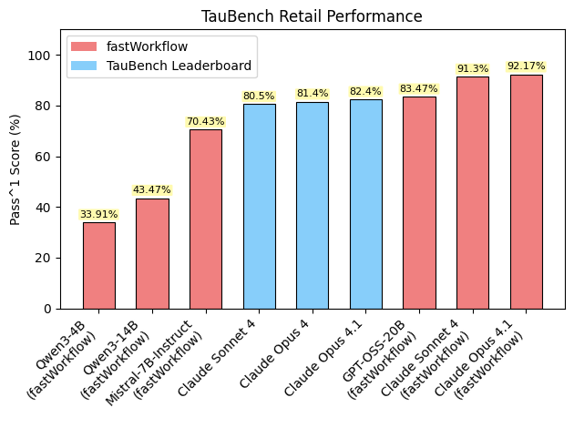
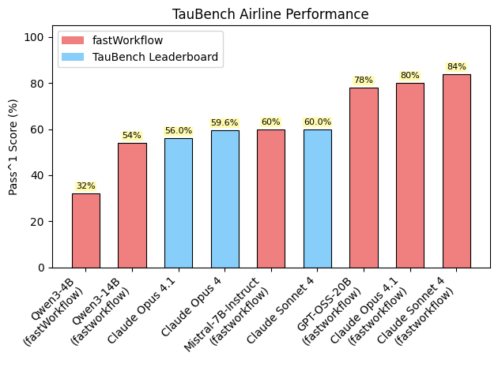
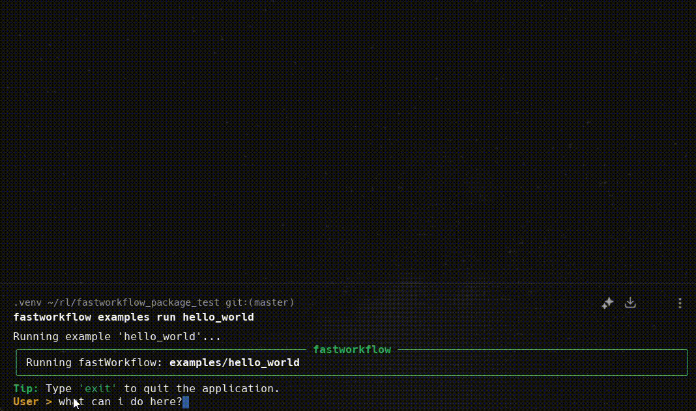
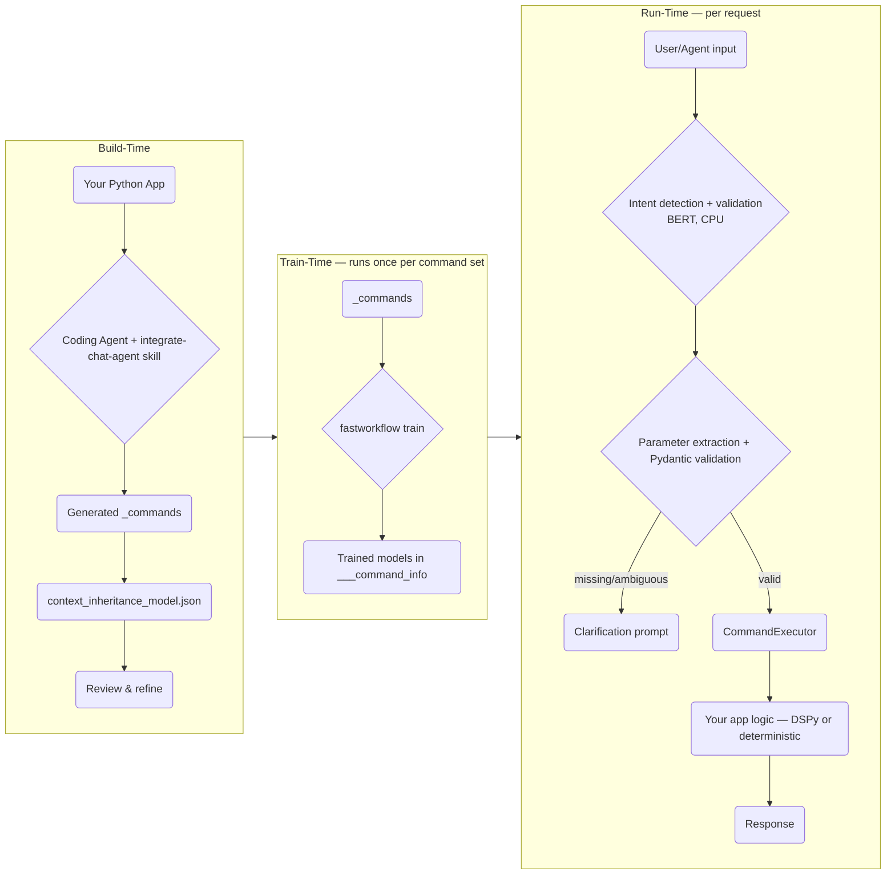

<!-- Logo and Title -->


[](LICENSE) [](https://pypi.org/project/fastworkflow/) [](https://github.com/radiantlogicinc/fastworkflow/actions) [](https://discord.gg/k2g58dDjYR) [](https://www.alphaxiv.org/abs/2605.fastworkflow)

**Build AI agents your application can actually trust in production — with small models cheaply, or frontier models more reliably.**

Most agent frameworks help you *build* an agent in an afternoon. fastWorkflow is for the moment after the demo, when you need the agent to stop calling the wrong tool, stop hallucinating parameters, and stop confidently doing the wrong thing on real, messy user input.

> **fastWorkflow improves agent reliability two ways:**
> 1. It lets **small, free models** (e.g. Mistral Small) perform far above their weight on structured workflows — matching frontier models on agentic benchmarks.
> 2. It makes **frontier models more reliable** by shrinking the active toolset, validating every parameter, and forcing clarification instead of silent wrong actions.

---

## The failure fastWorkflow exists to fix

You wire up a dozen tools to a capable frontier model. In dev, against clean prompts, it works great. Then real users show up:

```text
User: "cancel that blue jacket order from last week and give me credit, not a refund"

[ Generic tool-calling stack + frontier model ]
search_orders(query="blue jacket")                              ✓
cancel_order(order_id="44821")                                  ✓
process_refund(order_id="44821", method="original_payment")     ✗  ← user asked for store credit
```

Nothing crashed. The logs look fine. But the customer asked for **store credit** and got a refund to their card. This is the dangerous failure class: **plausible-looking, semantically wrong execution.** No amount of prompt engineering reliably prevents it at scale, because the problem is structural — ambiguous language, missing parameters, and a crowded toolset — not a weak model.

Here's the same request through fastWorkflow:

```text
User: "cancel that blue jacket order from last week and give me credit, not a refund"

[ fastWorkflow ]
Intent detected:      cancel_order
Parameter validation: order_id unresolved        → ask, don't guess

Agent: "I found two recent orders — #44821 (Blue Jacket, $89) and
        #44798 (Blue Scarf, $34). Which should I cancel?"
User:  "the jacket"

Parameter validation: refund_method = store_credit   ✓ (from "credit, not a refund")
cancel_order(order_id="44821", refund_method="store_credit")   ✓
notify_customer(order_id="44821")                              ✓
```

Same model. Same application code. Different execution discipline. **The framework makes the system harder to use incorrectly.**

---

## What fastWorkflow does differently

Instead of dumping your whole tool catalog into a prompt and hoping the model navigates it, fastWorkflow puts a structured execution layer between natural language and your application's side effects:

1. **Intent detection is trained locally** — a tiny BERT/DistilBERT classifier (runs on CPU, ~milliseconds) maps utterances to commands instead of relying entirely on the LLM to infer what the user "probably meant."
2. **Every parameter is validated** against your Pydantic `Field` definitions *before* your code runs — malformed or missing values are caught, not executed.
3. **Clarification is a first-class behavior** — when a required parameter is missing or ambiguous, the agent asks instead of guessing.
4. **Tools are organized into context hierarchies** — the model only ever sees the handful of tools relevant to the current state, never all 40 at once.
5. **Your application code stays the source of truth** — fastWorkflow *wraps* it; it never replaces or rewrites it.

---

## Why this helps frontier models too

A common reaction is: *"Nice for cheap small models, but I already use GPT-4o / Claude / Bedrock."* That's exactly where fastWorkflow still earns its place. Frontier models are better at language — but they still fail on the parts of agent systems that are **architectural, not linguistic**:

| Failure mode | What goes wrong | fastWorkflow's structural fix |
|---|---|---|
| **Tool overload** | Picks a valid-but-wrong tool from a crowded prompt | Context hierarchies keep the active toolset small |
| **Parameter overconfidence** | Extracts one slot wrong and executes anyway | Pydantic validation gate before execution |
| **State blindness** | Acts as if every tool is always available | Tools enabled/disabled by runtime context |
| **Ambiguity collapse** | Resolves uncertainty internally instead of asking | Clarification is built in, not prompted for |

With small models, fastWorkflow is mostly about **cost**. With large models, it's about **reliability and reducing expensive mistakes**. Either way, you get one consistent command layer for UI chat, backend automation, tests, and internal agents.

---

## Benchmark: small models, frontier-level reliability

fastWorkflow was benchmarked on [Tau Bench](https://github.com/sierra-research/tau-bench) — an industry-standard benchmark for conversational agents that complete realistic, multi-step, tool-using customer-service workflows (order management, flight rebooking, policy enforcement). This measures exactly what breaks in production: **reliable tool execution under ambiguity**, not generic chat quality.

<p align="center">
  <table>
    <tr>
      <td align="center" width="50%">
        
        <br/><em>Retail: orders, returns, account operations</em>
      </td>
      <td align="center" width="50%">
        
        <br/><em>Airline: rebooking, baggage, loyalty workflows</em>
      </td>
    </tr>
  </table>
</p>

**fastWorkflow with Mistral Small (free tier) matches frontier models on these structured workflows** — because the validation pipeline outweighs raw model capability where it counts.

> **Citation:** Sanchit Satija, Aditya Bhatt, Priyanshu Jani, and Dhar Rawal. 2026. *fastWorkflow: Closing the Performance Gap Between Small and Frontier Language Models for Conversational Agents.* In *Proceedings of the ACM Conference on AI Systems (CAIS '26)*. ACM, San Jose, CA, USA, 161–180. https://doi.org/10.1145/3786335.3813158

##### Mistral Small handling a complex Tau Bench Retail command

<p align="center">
  
</p>

---

## Table of Contents

- [Quick Start: run an example in 5 minutes](#quick-start-run-an-example-in-5-minutes)
- [AI-enable your own app (without restructuring it)](#ai-enable-your-own-app-without-restructuring-it)
- [How complex workflows scale: context hierarchies](#how-complex-workflows-scale-context-hierarchies)
- [Chat with it and debug it: `run_chatbot`](#chat-with-it-and-debug-it-run_chatbot)
- [Production deployment](#production-deployment)
- [Developer FAQ](#developer-faq)
- [Key concepts (going deeper)](#key-concepts-going-deeper)
- [Architecture overview](#architecture-overview)
- [Installation](#installation)
- [CLI reference](#cli-reference)
- [Environment variables reference](#environment-variables-reference)
- [Troubleshooting / FAQ](#troubleshooting--faq)
- [For contributors](#for-contributors)
- [Our work & references](#our-work--references)
- [License](#license)

---

## Quick Start: run an example in 5 minutes

This is the fastest way to see fastWorkflow in action.

<p align="center">
  
</p>

```sh
# 1. Install (Linux/macOS; on Windows use WSL. Python 3.13+)
pip install fastworkflow

# 2. Fetch the hello_world example + env file templates
fastworkflow examples fetch hello_world

# 3. Add your API key (a free Mistral key works for every role)
nano ./examples/fastworkflow.passwords.env

# 4. Build the intent models for this command set (one-time, ~5 min on CPU)
fastworkflow train ./examples/hello_world ./examples/fastworkflow.env ./examples/fastworkflow.passwords.env

# 5. Run it
fastworkflow run ./examples/hello_world ./examples/fastworkflow.env ./examples/fastworkflow.passwords.env
```

You'll get a `User >` prompt. Try **"what can you do?"** or **"add 49 + 51"**. Run `fastworkflow examples list` to see the rest.

> [!note]
> **"Train" doesn't mean GPUs or fine-tuning a foundation model.** `fastworkflow train` is closer to *compiling a conversational interface*: it generates synthetic utterances and fits small BERT-class intent classifiers for your commands. You run it once per command set, re-run it only when commands change, ship the resulting artifacts with your app, and need **no GPU at runtime**.
>
> Training manages its own safety and incremental work. It checks command seeds for
> duplicate capabilities before making LLM calls, warns when commands have thin seed
> coverage, reuses cached utterances, and retrains only affected contexts when that is
> provably safe. Global changes or an incomplete baseline automatically trigger a full
> retrain. Models are published atomically; fastWorkflow retains only the current model
> set and one previous recovery point. Use `--regenerate-utterances` only when you
> intentionally want to discard the generated-data caches.

> [!tip]
> Get a free API key from [Mistral AI](https://mistral.ai) (works with `mistral-small-latest`) or [OpenRouter](https://openrouter.ai/openai/gpt-oss-20b:free). You can assign different models to different roles in the same workflow.

---

## AI-enable your own app (without restructuring it)

You do **not** rewrite your application around fastWorkflow. You wrap your existing code with thin command files. Say you already have this service:

```python
# your_app/orders.py  ← your existing code, untouched
class OrderService:
    def cancel_order(self, order_id: str, refund_method: str) -> dict: ...
    def get_order_status(self, order_id: str) -> dict: ...
    def update_shipping_address(self, order_id: str, address: str) -> dict: ...
```

### Recommended: let a coding agent wrap it for you

The fastest path for a non-trivial app is the **[integrate-chat-agent](./fastworkflow/skills_for_coding_fastworkflows/integrate-chat-agent) skill** with Cursor or Claude Code:

```text
Open fastworkflow/skills_for_coding_fastworkflows/integrate-chat-agent/SKILL.md
Prompt: "Integrate a fastWorkflow chat agent for OrderService in orders.py"
```

The agent introspects your code and generates `_commands/cancel_order.py`, `_commands/get_order_status.py`, the `context_inheritance_model.json`, and env scaffolding — then trains and smoke-tests it with you. **Your `orders.py` is never modified.**

### Or write a command wrapper by hand (~5 minutes per command)

```python
# _commands/cancel_order.py  ← new file; wraps your existing code
import fastworkflow
from fastworkflow.train.generate_synthetic import generate_diverse_utterances
from pydantic import BaseModel, Field

from your_app.orders import OrderService


class Signature:
    class Input(BaseModel):
        order_id: str = Field(
            description="The order ID to cancel",
            examples=["44821", "ORD-2024-001"],
            default="NOT_FOUND",          # missing → fastWorkflow asks instead of guessing
        )
        refund_method: str = Field(
            description="How to refund the customer",
            examples=["store_credit", "original_payment"],
            default="original_payment",
        )

    plain_utterances = [
        "Cancel order #44821 and give store credit",
        "cancel that blue jacket order, I want credit not a refund",
    ]

    @staticmethod
    def generate_utterances(workflow: fastworkflow.Workflow, command_name: str) -> list[str]:
        return [command_name.split("/")[-1].lower().replace("_", " ")] + \
            generate_diverse_utterances(Signature.plain_utterances, command_name)


class ResponseGenerator:
    def __call__(
        self,
        workflow: fastworkflow.Workflow,
        command: str,
        command_parameters: Signature.Input,
    ) -> fastworkflow.CommandOutput:
        result = OrderService().cancel_order(
            order_id=command_parameters.order_id,
            refund_method=command_parameters.refund_method,
        )
        return fastworkflow.CommandOutput(
            command_response=fastworkflow.CommandResponse(response=str(result))
        )
```

Then `fastworkflow train` and `fastworkflow run` against your workflow directory. That's the entire integration pattern: a thin command layer over code you already have.

> [!TIP]
> `plain_utterances` is the highest-leverage thing you write. Training expands your seeds
> into the synthetic corpus the intent classifier learns from, so seed count and phrasing
> variety matter more to routing accuracy than any other dial. The two above are enough to
> get started; before you ship, grow each command to roughly eight varied phrasings —
> imperative, question, colloquial, terse — rather than paraphrases of one sentence. (The
> "roughly eight" figure is where returns flattened on one large internal workflow, not a
> universal constant.)

> [!tip]
> Prefer to learn by building the smallest possible workflow by hand first? `fastworkflow examples fetch messaging_app_1` is a minimal, fully-worked single-command workflow you can read end-to-end.

---

## How complex workflows scale: context hierarchies

At 5 tools, a frontier model is reliable. At 40 — a realistic enterprise workflow — accuracy drops: the model sees every tool in the prompt and starts choosing valid-but-wrong ones.

fastWorkflow keeps the active toolset small by modeling your application's object model as **contexts**. The agent only sees tools relevant to the *current* context:

```text
User                                ← always visible
├── search_orders()
├── get_customer_info()
│
└── Order        (active once an order is selected)
    ├── cancel_order()
    ├── update_address()
    │
    └── Refund   (active during a refund flow)
        ├── issue_store_credit()
        ├── issue_original_payment()
        └── escalate_to_human()
```

Context relationships live in **one file**, `context_inheritance_model.json` — not code. Each entry uses `base` (parent contexts whose commands are inherited) and optionally `/` (commands declared directly on the context):

```json
{
  "Order": {
    "base": ["User"]
  },
  "Refund": {
    "base": ["Order"]
  }
}
```

This is what lets small models stay accurate as your app grows — and what keeps frontier models from drowning in tool definitions.

---

## Chat with it and debug it: `run_chatbot`

When a turn does the wrong thing, the question is almost always *which stage* got it wrong: did intent detection pick the wrong command, did parameter extraction mis-fill an argument, or did the command itself fail? `run_chatbot` answers that without a debugger.

Every run records what it did to a per-workflow SQLite database, `observability.sqlite3`, under `FASTWORKFLOW_STATE_ROOT/workflows/<workflow-id>/`. `run_chatbot` is a local browser UI over the workflow: a chat client for driving new turns, and a trace viewer for everything that already happened.

```sh
fastworkflow run_chatbot
```

One command opens the workflow picker, then starts the selected workflow's FastAPI server for you (loopback-only, stopped when the chatbot exits), picks a free port, and connects the chat — no server URL, token, channel, workflow path, or env-file CLI arguments to fill in. Env files are auto-detected in the workflow directory and, for bundled workflows, the shared `examples/` directory. If either is missing, choose existing files in the browser or create owner-only workflow-local copies from the bundled templates.

```
fastWorkflow Chatbot
  pick a workflow in the browser (bundled examples
  and local folders are listed; you can browse anywhere).

  Open in your browser:

    http://127.0.0.1:8901/?token=Bg4-uLpLdETJAsYbGzXbfRQdAEhitS6p8podPXmK25g
```

Use that printed URL. It carries a one-off token, and requests without it are refused — so one you leave running is not readable by anything else on the machine. Pass `--server-port` to skip spawning and use a FastAPI server already running on that port. The page opens with a workflow picker: bundled examples plus a directory browser, with a **Switch workflow** button to change later.

### Debug mode: what a turn actually did

Debug mode nests turns directly beneath their conversations (with a separate conversation-less group when needed), and opens any turn into a span tree — the nested record of the stages that ran, each with its duration, status, and attributes:

```
fw.turn                        the whole logical turn (stable across ask_user suspensions)
├── fw.planner.plan            the agent's plan for the turn (fw.planner.replan on a re-plan)
│   └── fw.llm.call            the planner's LLM request/response
└── fw.agent.execute           the ReAct loop as a whole (attempts, final answer)
    └── fw.agent.step          one reasoning step: thought, chosen tool, observation
        ├── fw.llm.call        the step's reasoning LLM call (+ provider-native reasoning)
        └── fw.agent.tool_call the agent invoking a command
            └── fw.command.execute   resolution + your business logic running
                ├── fw.nlu.intent            which matching layer decided, classifier
                │                            confidence vs threshold, candidates on ambiguity
                └── fw.nlu.param_extraction  extraction method, missing/invalid fields,
                    │                        db_lookup outcomes, validation-hook verdict
                    └── fw.llm.call          the LLM extraction call, when one ran
fw.ask_user                    a clarifying question, and how long the user took

(Deterministic "/"-mode turns skip the planner/agent layers: fw.command.execute
sits directly under fw.turn.)
```

The diagnosis lives in the attributes of `fw.command.execute`. It records `raw_command` (the natural-language command the agent sent), `command_name` (what intent detection *resolved* it to), the extracted `parameters`, the `response_text`, and `success`. Comparing the first two is the whole trick:

- **`raw_command` was reasonable but `command_name` is the wrong command** → an intent-detection miss. Add seed utterances for that command and retrain.
- **`command_name` is right but `parameters` are wrong** → a parameter-extraction miss. Strengthen the `Field(description=…, examples=[…])` in that command's Signature.
- **Both right, span status is `error`** → the bug is in your own code, and `response_text` usually says how.

Two turn-level fields are worth knowing because they are deliberately independent. `status` is the turn's lifecycle (`completed`, `failed`, …) and `success` means every command in it succeeded. A turn that is `completed` but not `success` is the case worth hunting: a command failed and the agent wrote a confident answer over it.

Coding agents can run this diagnosis directly against the database: the wheel-shipped [`debug-workflow-conversations`](fastworkflow/skills_for_coding_fastworkflows/debug-workflow-conversations/SKILL.md) skill carries the failure-triage decision tree, the full schema and span-attribute contract, and the routing table from each diagnosis to the fastWorkflow feature (and companion skill) that fixes it.

The **Health** view reports the background writer's state and the database size, which is how you tell "no spans recorded" apart from "spans dropped under load."

### Chat: drive the workflow from the browser

The Chat tab is connected the moment the workflow's server is ready (the first start loads models, so give it a moment — the page tells you what it is waiting on). Every turn is recorded like any other, so you can send a message and immediately open its span tree via its **view trace** link or the Debug tab.

Messages go to `/invoke_agent`; prefix one with `/` to force deterministic execution via `/invoke_assistant`, the same convention as the CLI prompt. **New conversation** in the header archives the current thread and starts a fresh one, like the CLI's `//new`. Sessions are single-developer by design: the chatbot manages one fixed private channel (`chatbot`), so there is nothing multi-user to configure and your history is in one place across launches.

There is deliberately no box for a startup command or a per-session context: the session is driven by what you type, so pre-seeding it from a chat form makes no sense. Those stay launch-time decisions — `run_fastapi_mcp --startup_command`, or the `/initialize` request fields if you are calling the API yourself.

A spawned server always binds `127.0.0.1`, has CORS pinned to loopback origins, and is stopped when the chatbot exits (SIGTERM included). It runs with unsigned dev JWTs — fine for a loopback-only dev server whose tokens the chatbot mints itself; pass `--expect-encrypted-jwt` to require signed tokens instead (then paste one in the chat's Advanced panel). Already have a server running? Launch with `--server-port <port>` and connect via the Advanced panel.

Insights distillation (`fastworkflow run --generate_insights`) stays CLI-only by design, as do bind address and env-file choices for externally managed servers. The full capability comparison is in [`docs/run_chatbot_cli_parity.md`](docs/run_chatbot_cli_parity.md).

### Retention and erasure

Trace data grows. Spans and artifacts are pruned beyond a retention horizon; **turn records and conversations are never deleted by a default prune**, so history survives.

Use **Clear conversations** in Debug mode for an explicit, confirmed reset. It removes conversation labels, turns, spans, artifacts, feedback, and legacy per-channel conversation files. Training runs, writer diagnostics, and monotonic conversation counters survive, so identities are never reused after a clear.

To turn recording off entirely, set `FW_OBSERVABILITY=0`.

---

## Production deployment

### Pattern 1 — host it as a FastAPI service (recommended)

Expose your workflow over HTTP with JWT auth, SSE/NDJSON streaming, and MCP support:

```sh
pip install "fastworkflow[server]"

python -m fastworkflow.run_fastapi_mcp \
  --workflow_path ./order_agent \
  --env_file_path ./fastworkflow.env \
  --passwords_file_path ./fastworkflow.passwords.env \
  --port 8000
```

Key endpoints: `/initialize` (create session + JWT), `/invoke_agent`, `/invoke_agent_stream` (SSE/NDJSON), `/invoke_assistant` (deterministic, non-agentic), `/perform_action` (direct programmatic calls), `/new_conversation`, `/conversations`, `/probes/healthz`, `/probes/readyz`.

### Pattern 2 — embed the core in an existing app

The execution core is synchronous and transport-free. Create one `WorkflowExecutionContext` per session and call `process_turn` per turn:

```python
import fastworkflow
from dotenv import dotenv_values
from fastworkflow.workflow_execution_context import WorkflowExecutionContext

# Load env + secrets once at startup
env_vars = {
    **dotenv_values("fastworkflow.env"),
    **dotenv_values("fastworkflow.passwords.env"),
}
fastworkflow.init(env_vars=env_vars)

# One context + bound workflow per session
ctx = WorkflowExecutionContext(run_as_agent=True, session_key="user-123")
app_workflow = fastworkflow.Workflow.create("./order_agent", workflow_id_str="user-123")
ctx.bind_app_workflow(app_workflow)

@app.post("/chat")
def chat(message: str):
    turn = ctx.process_turn(message)             # synchronous; run in a worker thread under async
    return {"response": turn.answer}
```

### Pattern 3 — Kubernetes

The service ships liveness/readiness probes out of the box. `/probes/readyz` returns `503` until the intent models are loaded, so traffic isn't routed before the agent is actually ready:

```yaml
livenessProbe:
  httpGet: { path: /probes/healthz, port: 8000 }
  initialDelaySeconds: 10
  periodSeconds: 10
readinessProbe:
  httpGet: { path: /probes/readyz, port: 8000 }
  initialDelaySeconds: 5
  periodSeconds: 5
```

### Handling secrets and PII

fastWorkflow persists session state so conversations survive restarts. Two things reach disk in the clear today:

- **command parameters**, in the conversation record written after every turn;
- **the agent's trajectory and its inputs**, in the pending-session file written whenever a turn suspends on `ask_user`.

Three norms, in priority order:

1. **A credential that arrives with a request belongs to that request.** Re-supply it per request rather than storing it in workflow context. fastWorkflow does this with the caller's JWT: it is refreshed on every authenticated request and is never written to session state.
2. **Keep secrets and PII out of command contexts, workflow context, and agent trajectories.** Pass an opaque handle — a user id, a lookup key — and resolve it to the sensitive value inside the command, where it stays in memory and never reaches a parameter, a trace, or a trajectory.
3. **If state is both long-lived and genuinely secret, encrypt it — with a key that does not travel with the ciphertext.** A key sitting beside the data it protects moves an audit checkbox, not the exposure. Use your deployment's KMS or secret manager.

---

## Developer FAQ

**Do I need a GPU?**
No. Intent detection (BERT/DistilBERT) runs on CPU in milliseconds. LLM calls go to whatever API you configure.

**Does training re-run on every deploy?**
No. `fastworkflow train` runs once per command set and writes artifacts to `___command_info/`. Bake those into your Docker image or CI artifact store; re-train only when you add or change commands.

**What actually ships to production?**
Your application code + your `_commands/` wrappers + the trained `___command_info/` artifacts (small BERT checkpoints). No GPU at runtime.

**Can I use Claude / GPT-4o / Bedrock instead of Mistral?**
Yes. fastWorkflow uses LiteLLM, so any provider works — set e.g. `LLM_AGENT=openai/gpt-4o` in `fastworkflow.env`. You can use different models for different roles (intent vs. extraction vs. response vs. planning).

**Can I route through a corporate LiteLLM proxy?**
Yes — prefix models with `litellm_proxy/` and set `LITELLM_PROXY_API_BASE`. See [Using LiteLLM Proxy](#using-litellm-proxy).

**What if a user asks something out of scope?**
Intent detection returns low confidence and fastWorkflow surfaces a clarification — it does not hallucinate a tool call. That's the core reliability guarantee.

**Can commands call REST APIs or databases, not just Python functions?**
Yes. `ResponseGenerator.__call__` is plain Python — call `requests`, `httpx`, an ORM, gRPC stubs, anything. fastWorkflow owns the NLP layer; your business logic is unrestricted.

---

## Key concepts (going deeper)

**Adaptive intent understanding** — Misunderstandings happen in every conversation. fastWorkflow does 1-shot adaptation from intent-detection mistakes, learning your conversational vocabulary as you interact; corrections can be persisted to improve the model across sessions.

**Signatures** — Pydantic `BaseModel` + `Field` (à la [DSPy](https://dspy.ai)) is the contract between natural language and your code. Strong descriptions and `examples` directly improve extraction accuracy, and the same schema feeds DSPy integration.

**Context navigation at runtime** — Classes hold state; method availability can change with state. fastWorkflow enables/disables commands and navigates object hierarchies at run-time, which is what makes complex, finite-state workflows possible.

**Deep code understanding** — fastWorkflow understands classes, methods, inheritance, and aggregation, so you can AI-enable large-scale Python applications by mapping them onto contexts and commands.

**DSPy for response generation** — use `dspy.Predict` inside `ResponseGenerator` when deterministic logic isn't enough; `dspySignature` bridges your Pydantic models to DSPy signatures while preserving types, descriptions, and examples:

```python
from fastworkflow.utils.dspy_utils import dspySignature
import dspy

dspy_sig = dspySignature(Signature.Input, Signature.Output)
prediction = dspy.Predict(dspy_sig)(command_parameters)
```

**Startup commands & headless mode** — initialize context or run non-interactively (batch/CI) by combining a startup command/action with `--keep_alive False`:

```sh
fastworkflow run my_workflow/ .env passwords.env \
  --startup_command "process daily report" --keep_alive False
```

Deep-dive articles:
- [From functions to classes: building stateful AI agents](fastworkflow-article-2.md)
- [Leveraging class inheritance in fastWorkflow](fastworkflow-article-3.md)
- [Building complex context hierarchies](fastworkflow-article-4.md)

---

## Architecture overview

fastWorkflow separates **build-time**, **train-time**, and **run-time**. At build-time you create a command interface from your code (recommended via the [integrate-chat-agent](./fastworkflow/skills_for_coding_fastworkflows/integrate-chat-agent) skill). `train` builds the NLP models; `run` executes the workflow. Your existing code is never modified — fastWorkflow sits as a layer on top.


```mermaid
graph LR
    subgraph A[Build-Time]
        A1(Your Python App) --> A2{Coding Agent + integrate-chat-agent skill};
        A2 --> A3(Generated _commands);
        A3 --> A4(context_inheritance_model.json);
        A4 --> A5(Review & refine);
    end

    subgraph B[Train-Time — runs once per command set]
        B1(_commands) --> B2{fastworkflow train};
        B2 --> B3(Trained models in ___command_info);
    end

    subgraph C[Run-Time — per request]
        C1(User/Agent input) --> C2{Intent detection + validation\nBERT, CPU};
        C2 --> C3{Parameter extraction + Pydantic validation};
        C3 -->|missing/ambiguous| C4(Clarification prompt);
        C3 -->|valid| C5(CommandExecutor);
        C5 --> C6(Your app logic — DSPy or deterministic);
        C6 --> C7(Response);
    end

    A --> B --> C
```

### Directory structure

```
order_agent/                         # <-- The workflow_folderpath
├── application/                     # <-- Your app code (untouched)
│   └── orders.py
├── _commands/                       # <-- Command wrappers (generated + edited)
│   ├── cancel_order.py
│   └── context_inheritance_model.json
├── ___command_info/                 # <-- Trained models (generated by `train`)
└── ___convo_info/                   # <-- NLU caches / conversation logs (run-time)

fastworkflow.env                     # model strings, logging, intent model ids
fastworkflow.passwords.env           # API keys

~/.local/state/fastworkflow/         # <-- FASTWORKFLOW_STATE_ROOT (run-time)
└── workflows/<workflow-id>/          #     one namespace per workflow
    ├── conversations/                #     {channel_id}.sqlite3
    ├── session_state/                #     suspended (awaiting_user) turns
    ├── checkpoints/                  #     per-channel checkpoints
    └── function_cache/               #     @enablecache, fingerprinted
```

> [!tip]
> Add `___command_info` and `___convo_info` to your `.gitignore`. Persistent
> run-time state lives outside the workflow folder, under `FASTWORKFLOW_STATE_ROOT`
> (default `~/.local/state/fastworkflow`), so it is not part of your repo.

---

## Installation

```sh
pip install fastworkflow              # core (CPU inference, plain litellm client)
pip install "fastworkflow[server]"    # adds the FastAPI/MCP HTTP service
pip install "fastworkflow[training]"  # adds HuggingFace datasets for the train step
# Or with uv: uv pip install fastworkflow
```

**Notes**
- Linux/macOS only — on Windows use WSL. Python 3.13–3.14 (stdlib `sqlite3` replaced the abandoned `speedict`/RocksDB dependency that blocked 3.13 installs).
- Installs PyTorch; the first install may take a few minutes.
- `fastworkflow train` needs the optional HuggingFace `datasets` package (`pip install datasets`, or `poetry install --with dev` from this repo).
- On-disk conversation stores are now `{channel_id}.sqlite3` under `FASTWORKFLOW_STATE_ROOT/workflows/<workflow-id>/conversations`. NLU caches use `*.sqlite3` under `___convo_info/`. Pre-existing RocksDB `.rdb` / `cache.db` directories are unused and may be deleted. Downstream shims that aliased `speedict.Rdict` to `rocksdict.Rdict` can be removed.

The core depends on **plain** `litellm` (client only — no proxy server stack), so it co-installs cleanly with downstream apps that pin a plain `litellm`. Server-only deps live behind the `server` extra.

**Breaking changes in 3.0.0 (no migration path — same as the SQLite switch):**
- **Persistent state relocated.** The `SPEEDDICT_FOLDERNAME` env var is removed. All run-time state now lives under `FASTWORKFLOW_STATE_ROOT` (default `~/.local/state/fastworkflow`), namespaced per workflow at `workflows/<workflow-id>/` (id = the workflow folder name, or `FASTWORKFLOW_WORKFLOW_ID`). Pre-3.0 state under the old CWD-relative folder is abandoned; suspended sessions and conversations do not carry over.
- **`WorkflowExecutionContext.process_message()` removed.** Use `process_turn()` (returns the public `TurnOutput`); it shares the same dispatch.
- **Session-state `schema_version` bumped to 3.** Older pending blobs are refused (not migrated) and the session starts clean.
- **Dead config removed.** `LLM_RESPONSE_GEN` / `LITELLM_API_KEY_RESPONSE_GEN` had no consumers and are gone from templates. `run` no longer hard-fails when `LITELLM_API_KEY_SYNDATA_GEN` is absent (warns instead — Bedrock/proxy setups don't need it).

### Dependency compatibility

| Package | Supported range | Notes |
|---|---|---|
| `transformers` | `>=4.48.2,<6.0.0` | Works on transformers 5.x (BERT/DistilBERT load natively) |
| `dspy` | `>=3.0.1,<4.0.0` | DSPy 3.x API |
| `openai` | `>=2.8.0` | Compatible with openai 2.x |
| `litellm` | `>=1.83.7,<2.0.0` | Client only; FastAPI server deps are in the `server` extra |
| `sentence-transformers` | not a dependency | imposes no constraint downstream |

The intent-detection base models are configurable via `INTENT_DETECTION_TINY_MODEL` / `INTENT_DETECTION_LARGE_MODEL`.

---

## CLI reference

```sh
# Examples
fastworkflow examples list
fastworkflow examples fetch hello_world

# Train intent-detection models (once per command set)
fastworkflow train <workflow_dir> <env_file> <passwords_file>

# Run — agentic mode is the default
fastworkflow run <workflow_dir> <env_file> <passwords_file>
fastworkflow run <workflow_dir> <env_file> <passwords_file> --assistant   # deterministic, non-agentic

# Headless (batch/CI)
fastworkflow run <workflow_dir> <env_file> <passwords_file> \
  --startup_command "your command" --keep_alive False

# Browser chatbot + observability viewer (`run` is also spelled `run_cli`);
# workflow, env files, and trace maintenance are chosen in the browser
fastworkflow run_chatbot
fastworkflow run_chatbot --server-port 8000        # pin the spawned server's port
fastworkflow run_chatbot --expect-encrypted-jwt    # require signed tokens

# Host as a FastAPI/MCP service
python -m fastworkflow.run_fastapi_mcp --workflow_path ./wf --port 8000
```

> [!tip]
> Prefix a natural-language command with `/` during an interactive run to force deterministic (non-agentic) execution. Add `--help` to any command for its full options.

---

## Environment variables reference

Two files per workflow (templates ship with `fastworkflow examples fetch`).

### `fastworkflow.env`

| Variable | Purpose | When needed | Default |
|:---|:---|:---|:---|
| `FASTWORKFLOW_STATE_ROOT` | Absolute root for all persistent state (conversations, suspended sessions, checkpoints, function caches) | Optional | `~/.local/state/fastworkflow` |
| `FASTWORKFLOW_WORKFLOW_ID` | Overrides the per-workflow state namespace (defaults to the workflow folder name) | Optional | *workflow folder name* |
| `LOG_LEVEL` | Log level (`DEBUG`…`CRITICAL`) | Optional | `INFO` |
| `LLM_SYNDATA_GEN` | Model for synthetic utterance generation | `train` | `mistral/mistral-small-latest` |
| `LLM_PARAM_EXTRACTION` | Model for parameter extraction | `train`, `run` | `mistral/mistral-small-latest` |
| `LLM_PLANNER` | Model for the agent's task planner | `run` (agent) | `mistral/mistral-small-latest` |
| `LLM_AGENT` | Model for the DSPy agent | `run` (agent) | `mistral/mistral-small-latest` |
| `LLM_CONVERSATION_STORE` | Model for conversation topic/summary | FastAPI service | `mistral/mistral-small-latest` |
| `LLM_CONVERSATION_STORE_TIMEOUT_SECONDS` | Per-attempt client-side deadline for the topic/summary call (2 attempts max) | Optional | `12` |
| `LITELLM_PROXY_API_BASE` | LiteLLM Proxy URL | with `litellm_proxy/` models | *not set* |
| `INTENT_DETECTION_TINY_MODEL` | HF id for the small intent model | `train` (optional) | `google/bert_uncased_L-4_H-128_A-2` |
| `INTENT_DETECTION_LARGE_MODEL` | HF id for the large intent model | `train` (optional) | `distilbert-base-uncased` |
| `FW_OBSERVABILITY` | Master switch for trace recording. `0` disables it. On by default for `run`/`run_fastapi_mcp`; off by default when embedding the core as a library | Optional | `1` (fastWorkflow entry points) |
| `FW_OBS_RETENTION_DAYS` | Age beyond which the automatic prune (run at recorder startup) drops spans/artifacts (turn records are exempt) | Optional | `30` |
| `FW_OBS_DB_MAX_BYTES` | Size cap; the automatic prune evicts oldest spans first while over it | Optional | `1073741824` (1 GiB) |
| `FW_OBS_CAPTURE_TRACEBACKS` | Persist exception tracebacks as artifacts. Off by default because tracebacks can carry sensitive values | Optional | `0` |

### `fastworkflow.passwords.env`

| Variable | For | When needed |
|:---|:---|:---|
| `LITELLM_API_KEY_SYNDATA_GEN` | `LLM_SYNDATA_GEN` | `train` |
| `LITELLM_API_KEY_PARAM_EXTRACTION` | `LLM_PARAM_EXTRACTION` | `train`, `run` |
| `LITELLM_API_KEY_PLANNER` | `LLM_PLANNER` | `run` (agent) |
| `LITELLM_API_KEY_AGENT` | `LLM_AGENT` | `run` (agent) |
| `LITELLM_API_KEY_CONVERSATION_STORE` | `LLM_CONVERSATION_STORE` | FastAPI service |
| `LITELLM_PROXY_API_KEY` | shared LiteLLM Proxy key | with `litellm_proxy/` models |

### Using LiteLLM Proxy

Route LLM calls through a [LiteLLM Proxy](https://docs.litellm.ai/docs/simple_proxy) to centralize keys or unify providers — prefix model strings with `litellm_proxy/`:

```sh
# fastworkflow.env
LLM_AGENT=litellm_proxy/bedrock_mistral_large_2407
LITELLM_PROXY_API_BASE=http://127.0.0.1:4000
# fastworkflow.passwords.env
LITELLM_PROXY_API_KEY=your-proxy-api-key
```

When a model uses the `litellm_proxy/` prefix, the per-role keys are ignored and the shared proxy key is used. You can mix proxied and direct models.

---

## Troubleshooting / FAQ

> **`PARAMETER EXTRACTION ERROR`** — the LLM couldn't extract a required parameter. Rephrase more specifically, or strengthen the `Field(description=…, examples=[…])` in your Signature.

> **`CRASH RUNNING FASTWORKFLOW`** — the persistent-state folder is corrupted. Delete `FASTWORKFLOW_STATE_ROOT/workflows/<workflow-id>/` (default `~/.local/state/fastworkflow/...`) and re-run.

> **Slow first training run** — the first run downloads BERT/DistilBERT from HuggingFace and makes LLM calls for synthetic-utterance generation. Set `HF_HOME=/path/to/cache` to control model storage; later runs skip the download. A small workflow trains in ~5–8 minutes on CPU.

> **Commands not recognized** — a command module with an import/syntax error won't load and won't appear as an intent. Check your `_commands/*.py` files.

> **The agent did something unexpected** — open the chatbot (`fastworkflow run_chatbot`, then pick the workflow) and read the turn's span tree. It shows which command intent detection chose, what parameters were extracted, and whether your command failed — usually enough to identify the stage at fault before reaching for a debugger.

> [!tip]
> To debug command files, set up a VSCode `launch.json` with `justMyCode: false`, add breakpoints, and run in debug mode.

---

## For contributors

```sh
git clone https://github.com/radiantlogicinc/fastworkflow.git
cd fastworkflow
python -m venv .venv && source .venv/bin/activate
pip install -e ".[dev]"
```

[Join our Discord](https://discord.gg/k2g58dDjYR) — ask questions, discuss functionality, and showcase your fastWorkflows.

---

## Our work & references

- [Optimizing intent classification with a sentence-transformer pipeline — Part 1](https://medium.com/@adihbhatt04/optimizing-intent-classification-with-a-sentence-transformer-pipeline-architecture-part-2-pca-f353e68696ab)
- [Optimizing intent classification with a sentence-transformer pipeline — Part 2](https://medium.com/@adihbhatt04/optimizing-intent-classification-with-a-sentence-transformer-pipeline-architecture-part-1-586192b25d42)
- [Structured understanding: parameter extraction across leading LLMs](https://medium.com/@sanchitsatija55/structured-understanding-a-comparative-study-of-parameter-extraction-across-leading-llms-8e65b0333ddf)
- [A generalized parameter extraction framework](https://medium.com/@sanchitsatija55/a-generalized-parameter-extraction-framework-dab9adfd1eef)
- [DSPy — Compiling Declarative Language Model Calls into Self-Improving Pipelines](https://arxiv.org/abs/2310.03714)
- [LLMs Can't Plan, But Can Help Planning in LLM-Modulo Frameworks](https://openreview.net/forum?id=Th8JPEmH4z)

---

## License

`fastWorkflow` is released under the Apache License 2.0 — see [LICENSE](LICENSE).
