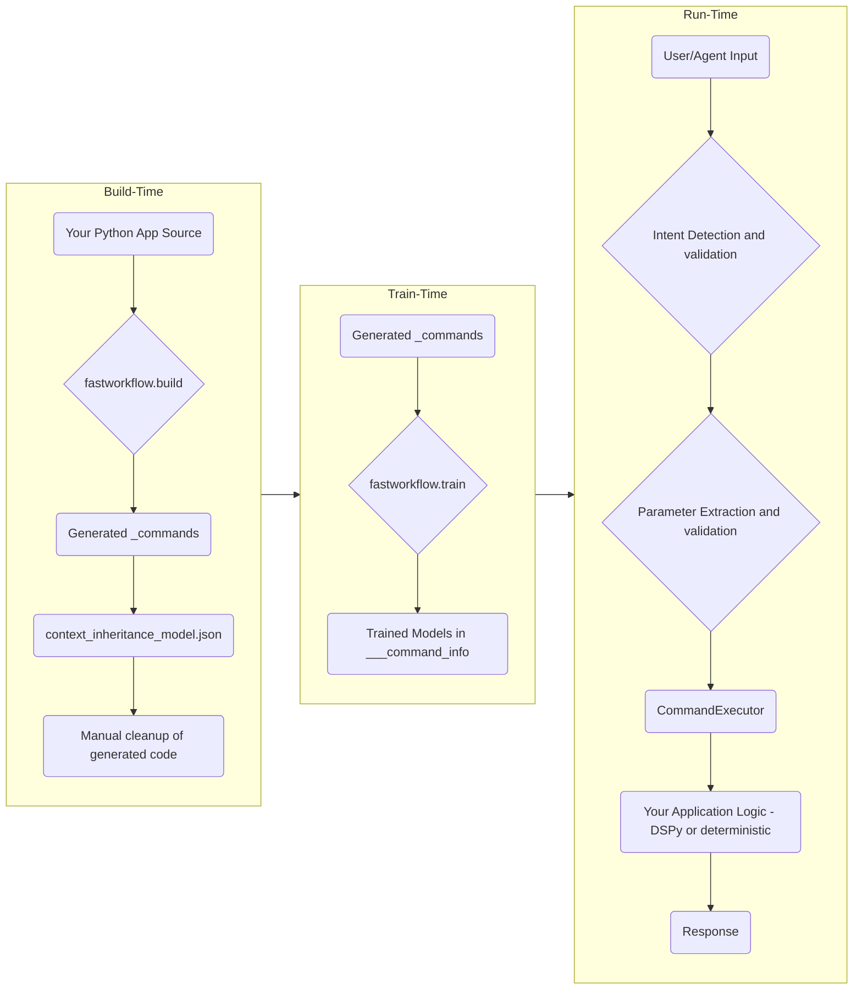

# Introducing fastWorkflow: Build Reliable AI Agents for Complex, Large-Scale Applications


---

If you have tried building AI agents for non-trivial applications, you have likely struggled with the following:

-   AI assistants misunderstanding your intent and not adapting to your vocabulary.
-   AI agents calling the wrong tools or getting lost in complex call chains.
-   Hallucinations in parameter extraction for tool calls.
-   Challenges in supporting humans, agents, and client code simultaneously with one codebase.

While frameworks like [DSPy](https://dspy.ai) are amazing for optimizing LLM generation, we need an application framework that understands core DSPy concepts (like signatures and optimization) and layers functionality on top to solve these challenges.

That's where **fastWorkflow** comes in.

---

### Why fastWorkflow?

**fastWorkflow** is an application framework designed to build reliable agents and assistants for complex workflows and large-scale Python applications, using either deterministic or AI-powered business logic.

-   ✅ **Unlimited Tool Scaling**: Scale to an unlimited number of tools without sacrificing performance or accuracy.
-   ✅ **Cost-Effective Performance**: With `fastWorkflow`, small, free models can match the quality of large, expensive ones.
-   ✅ **Reliable Tool Execution**: A robust validation pipeline virtually eliminates incorrect tool calling and faulty parameter extraction.
-   ✅ **Adaptive Learning**: It learns your conversational vocabulary as you interact with it, adapting from intent detection mistakes in a single shot.
-   ✅ **Interface Flexibility**: Support programmatic, assistant-driven, and agent-driven interfaces with the same codebase.
-   ✅ **Deep Code Understanding**: `fastWorkflow` understands classes, methods, inheritance, and aggregation, so you can quickly AI-enable large-scale Python applications.

Here’s a glimpse of a Mistral Small agent, powered by `fastWorkflow`, tackling a complex command from the Tau Bench Retail benchmark:

<p align="center">
  
</p>

---

### The Key Concepts Behind the Magic

`fastWorkflow` is built on a few core principles that make it so powerful.

#### 1. Adaptive Intent Understanding
Misunderstandings happen. Natural language applications should have intent clarification and parameter validation built-in. `fastWorkflow` can adapt its semantic understanding of words and sentences in one shot, based on the context of the conversation.

#### 2. Contextual Hierarchies
Communication is always contextual. In programming, we express contexts as classes and context hierarchies using inheritance and aggregation. `fastWorkflow` understands these concepts out-of-the-box, allowing it to navigate complex application structures.

#### 3. Signatures
Signatures (inspired by [Pydantic](https://docs.pydantic.dev/latest/) and [DSPy](https://dspy.ai)) are the most efficient way to map natural language commands to tool implementations. They form the backbone of `fastWorkflow`, enabling seamless integration with DSPy for producing LLM-generated content within a deterministic framework.

#### 4. Code Generation
AI-enabling complex applications is hard. `fastWorkflow` includes build tools that can quickly map natural language commands to your existing application's classes and methods, moving you beyond simple prototypes and demos.

#### 5. Context Navigation at Runtime
Workflows are often stateful. `fastWorkflow` supports dynamically enabling and disabling methods and navigating object instance hierarchies at runtime, giving you the building blocks to create complex, stateful workflows.

---

### A Look at the Architecture

`fastWorkflow` separates the **build-time**, **train-time**, and **run-time** concerns. The `build` tool creates a command interface from your code, the `train` tool builds NLP models to understand commands, and the `run` scripts execute the workflow.



---

## Quick Start: See it in Action in 5 Minutes

This is the fastest way to experience `fastWorkflow`.

<p align="center">
  
</p>

### Step 1: Installation

First, install `fastWorkflow` from PyPI. It requires Python 3.11+.

```sh
# Using pip
pip install fastworkflow

# Or with the super-fast uv
uv add fastworkflow
```
> **Note:** `fastWorkflow` works on Linux and macOS. For Windows, please use WSL. The installation includes PyTorch, which might take a few minutes.

### Step 2: Fetch the `hello_world` Example

The `fastworkflow` CLI can fetch bundled examples for you.

```sh
fastworkflow examples fetch hello_world
```
This command copies the `hello_world` example into `./examples/hello_world/` and sets up the necessary environment files.

### Step 3: Add Your API Keys

The example workflow uses Mistral's free tier model. Edit the passwords file to add your API key.

```sh
# Edit the passwords file to add your API keys
nano ./examples/fastworkflow.passwords.env
```

You can get a free API key from [Mistral AI](https://mistral.ai). You'll need to add it for the different LLM roles:
```
LITELLM_API_KEY_SYNDATA_GEN=your-mistral-api-key
LITELLM_API_KEY_PARAM_EXTRACTION=your-mistral-api-key
LITELLM_API_KEY_RESPONSE_GEN=your-mistral-api-key
LITELLM_API_KEY_AGENT=your-mistral-api-key
```

### Step 4: Train the Example

Next, train the intent-detection models for the workflow. This step builds the NLP models that help the workflow understand user commands.

```sh
fastworkflow examples train hello_world
```

### Step 5: Run the Example

Once training is complete, run the interactive assistant!

```sh
fastworkflow examples run hello_world
```

You’ll be greeted with a `User >` prompt. Try asking it "what can you do?" or "add 49 + 51"!

---

## Building Your First Workflow: The Manual Approach

Before we automate everything, let’s hand-craft the smallest possible workflow. Walking through each file will make the generated output from the build tool much easier to understand later.

> [!tip]
> You can fetch messaging_app_1 code using `fastworkflow examples fetch messaging_app_1` if you want to skip writing the code 

### Step 1: Create Project Directories

First, create the main directory for your workflow and a subdirectory for your application code.

```sh
mkdir -p messaging_app_1/application
```

### Step 2: Write Your Application Code

Create a simple function in `messaging_app_1/application/send_message.py`. This is your core business logic.

```python
# messaging_app_1/application/send_message.py

def send_message(to: str, message: str) -> str:
    """A simple function to simulate sending a message."""
    print(f"Sending '{message}' to {to}")
```

### Step 3: Write the Command File

Now, create a command file at `messaging_app_1/_commands/send_message.py`. This file is the bridge between `fastWorkflow` and your application. It defines the command's **signature** and how to **process** it.

```python
# messaging_app_1/_commands/send_message.py

import fastworkflow
from fastworkflow.train.generate_synthetic import generate_diverse_utterances
from pydantic import BaseModel, Field

# Import the actual function from your application
from ..application.send_message import send_message

# The Signature class defines our intent and its parameters
class Signature:
    class Input(BaseModel):
        to: str = Field(
            description="Who are you sending the message to",
            examples=['jsmith@abc.com', 'jane.doe@xyz.edu'],
            pattern=r'^[a-zA-Z0-9_.+-]+@[a-zA-Z0-9-]+\.[a-zA-Z0-9-.]+$'
        )
        message: str = Field(
            description="The message you want to send",
            examples=['Hello, how are you?', 'Hi, reaching out to discuss fastWorkflow'],
            min_length=3,
            max_length=500
        )

    # Provide a few plain examples of how a user might phrase this command
    plain_utterances = [
        "Tell john@fastworkflow.ai that the build tool needs improvement",
    ]

    @staticmethod
    def generate_utterances(workflow: fastworkflow.Workflow, command_name: str) -> list[str]:
        """This function generates more diverse utterances for training the NLP model."""
        return [
            command_name.split('/')[-1].lower().replace('_', ' ')
        ] + generate_diverse_utterances(Signature.plain_utterances, command_name)

# The ResponseGenerator class processes the command
class ResponseGenerator:
    def _process_command(self, workflow: fastworkflow.Workflow, input: Signature.Input) -> None:
        """Helper function that executes the application logic."""
        # Call the application function with validated parameters
        send_message(to=input.to, message=input.message)

    def __call__(self, 
                 workflow: fastworkflow.Workflow, 
                 command: str, 
                 command_parameters: Signature.Input) -> fastworkflow.CommandOutput:
        """The framework calls this function to process the command."""
        self._process_command(workflow, command_parameters)
        
        response = (
            f'Context: {workflow.current_command_context_displayname}\n'
            f'Command: {command}\n'
            f'Command parameters: {command_parameters}\n'
            f'Response: The message was printed to the screen'
        )

        return fastworkflow.CommandOutput(
            workflow_id=workflow.id,
            command_responses=[
                fastworkflow.CommandResponse(response=response)
            ]
        )
```

### Step 4: Setup Environment and Password Files

Copy the environment files from the `hello_world` example you fetched earlier.

-   Copy `fastworkflow.env` from `examples/` to `./messaging_app_1/`
-   Copy `fastworkflow.passwords.env` from `examples/` to `./messaging_app_1/`
-   Make sure your Mistral API key is in `./messaging_app_1/fastworkflow.passwords.env`.

### Step 5: Train and Run

Your manual workflow is ready!

First, train the workflow. `fastWorkflow` will use the `Signature` class and `generate_utterances` function to create a model that understands how to trigger the `send_message` command.

```sh
# Train the workflow
fastworkflow train ./messaging_app_1 ./messaging_app_1/fastworkflow.env ./messaging_app_1/fastworkflow.passwords.env
```

Finally, run it!

```sh
fastworkflow run ./messaging_app_1 ./messaging_app_1/fastworkflow.env ./messaging_app_1/fastworkflow.passwords.env
```

You can now interact with your first hand-built workflow. Try typing: `tell team@example.com hello from my first workflow!`

---

## What's Next? From Functions to Full-Fledged Applications

And there you have it! In just a few minutes, you’ve gone from a simple Python function to an interactive, AI-powered command, complete with intent detection, parameter extraction, and a structured response.

This simple example already showcases the core value of `fastWorkflow`: it provides the scaffolding to reliably connect natural language to your code, ensuring that the right function gets called with the right parameters, every single time.

But we've only scratched the surface.

The real power of `fastWorkflow` shines when you move beyond standalone functions and start AI-enabling complex applications built with classes, inheritance, and rich object models. This is where `fastWorkflow`'s deep understanding of code structure truly sets it apart, allowing you to build sophisticated, stateful agents that can navigate your entire application.

This is the first of a four-part series designed to take you from the basics to building advanced AI agents. In our next article, we will take a major step forward and explore how to AI-enable class methods, manage state, and set context in your workflows.

**Next up: [Part 2: Calling Class Methods in fastWorkflow](./fastworkflow-article-2.md)** 